# 🧬 Projeto GAIA - Documentação de IHC

**Projeto:** GAIA (Visualização Computacional para Apoio ao Prognóstico de TEA)  
**Disciplina:** Interface Humano-Computador (IHC)  
**Semestre:** 2026

---

## 👥 Membros da Equipe

| Nome Completo | Matrícula |
| :--- | :--- |
| **[Gabriel Balbine de Andrades]** | [22.222.001-4] |

---

## 🚀 Entrega 1: Conhecendo o Problema (Definição do Escopo)
*Status: [Concluído]*

### 1.1) Membros de Equipe
*(Ver tabela acima)*

### 1.2) Título Original do TCC
> *ANÁLISE DE PADRÕES
COMPORTAMENTAIS NO TEA: DESAFIOS
DIAGNÓSTICOS E NOVAS FERRAMENTAS

TECNOLÓGICAS*

### 1.3) Nome do Orientador
* Prof. Victor Perrone Varela

### 1.4) Previsto desenvolver Interface?
- [x] Sim
- [ ] Não

### 1.5) Objetivo do trabalho?
Desenvolver uma solução tecnológica para **auxílio ao prognóstico**, processando vídeos de interações sociais para identificar padrões comportamentais típicos do espectro autista (como falta de contato visual e atenção compartilhada), fornecendo dados quantitativos para embasar a decisão médica.

### 1.6) Qual o produto final?
Um sistema desktop/web dividido em dois módulos distintos:
1.  **Módulo Admin (Dataset):** Para curadoria, ingestão de vídeos e refinamento do treinamento da IA.
2.  **Módulo Especialista (Clínico):** Para upload de vídeos de pacientes, análise pós-processada e visualização de dashboards de risco.

### 1.7) Quem é o usuário final deste produto?
Exclusivamente profissionais da saúde mental e pesquisadores:
* Psiquiatras
* Psicólogos / Neuropsicólogos
* Pesquisadores da área de neurodesenvolvimento

### 1.8) O que o usuário recebe de benefício ao usar esse produto?
O profissional ganha uma "segunda opinião" técnica baseada em métricas. A ferramenta destaca comportamentos sutis em vídeos (que poderiam passar despercebidos a olho nu) e gera um indicador de risco, servindo como um filtro objetivo para apoiar a elaboração do laudo clínico e justificar a necessidade de investigação aprofundada.

### 1.9) Quais as funcionalidades da ferramenta (visão do usuário)?
**Módulo Admin:**
* Ingestão de novos vídeos para o Dataset.
* Rotulagem e retreinamento do modelo.

**Módulo Especialista:**
* Upload de vídeos (análise assíncrona).
* Visualização do vídeo processado com *bounding boxes* (YOLO/MediaPipe).
* **Dashboard de Insights:** Gráficos de tempo de foco e contato visual.
* **Output de Decisão:** Indicador de "Probabilidade/Risco" sugerindo averiguação.

### 1.10) Quais tecnologias e ferramentas computacionais pretendem usar?
* **Backend/IA:** Python, YOLO (detecção), MediaPipe (Face Mesh/Pose).
* **Interface:** [Streamlit / React / Interface Web].
* **Infraestrutura:** Docker.

### 1.11) Qual é o contexto de uso dessa aplicação?
* **Ambiente:** Consultórios terapêuticos ou laboratórios de pesquisa (ambiente controlado).
* **Dinâmica:** Uso **assíncrono**. O profissional grava a sessão e submete o vídeo ao software posteriormente. A análise dos dados ocorre no computador do especialista durante a elaboração do laudo ou estudo do caso.

---

## 🔍 Entrega 2: Análise de Concorrência (Soluções Análogas)
*Status: [Concluído]*

### 1) Público Alvo
O sistema é destinado a **profissionais de saúde mental e pesquisadores** (Psiquiatras, Psicólogos, Neuropsicólogos) que buscam ferramentas de apoio à decisão clínica baseadas em evidências visuais quantitativas.

### 2) Análise de Concorrência

#### A. Principais Concorrentes (Referências de Interação)
| Nome | Área | Link | Descrição da Solução |
| :--- | :--- | :--- | :--- |
| **Aidoc** | Radiologia (IA) | [aidoc.com](https://www.aidoc.com/) | Plataforma de IA para radiologia que analisa imagens médicas (TC/Raio-X) para identificar anomalias agudas. Funciona como um sistema de triagem e priorização de lista de trabalho. |
| **Viz.ai** | Neurovascular (AVC) | [viz.ai](https://www.viz.ai/) | Utiliza IA para detectar sinais de AVC em tomografias computadorizadas e alerta a equipe médica em tempo real via aplicativo móvel, sincronizando o fluxo de cuidado. |
| **Lunit INSIGHT** | Oncologia | [lunit.io](https://www.lunit.io/) | Analisa imagens de Raio-X de tórax e mamografias para detectar nódulos e câncer, fornecendo uma pontuação de anormalidade e mapas de calor sobre a imagem. |


#### B. Características e funcionalidades
* **Triagem Automatizada ("Always-on AI"):** (Aidoc/Viz.ai) O sistema monitora o fluxo de imagens do hospital 24/7 e processa tudo automaticamente, sem necessidade de clique manual.
* **Alertas Móveis:** (Viz.ai) Foco na mobilidade; envia notificações críticas para o smartphone do médico, permitindo visualização rápida da imagem processada.
* **Mapas de Calor (Heatmaps):** (Lunit) A IA não diz apenas "tem câncer"; ela colore a região suspeita com um mapa de calor, ajudando o médico a focar sua atenção imediatamente na área correta.
* **Score de Probabilidade:** (Todos) Fornecem uma porcentagem de certeza ou "grau de risco" para cada caso analisado.

#### C. Experiência do usuário (UX) e Opiniões
* **Explicação Visual (Explainability):** A grande força da UX dessas ferramentas é a sobreposição visual (overlays). O médico vê a imagem original com as anotações da IA por cima (bounding boxes ou cores), o que valida a decisão da máquina.
* **Priorização:** Em vez de analisar exames em ordem cronológica (fila comum), a interface reorganiza a lista colocando os casos críticos (detectados pela IA) no topo.
* **Simplicidade:** Interfaces limpas, geralmente em modo escuro (Dark Mode) para destacar o contraste das imagens médicas.

#### D. Preços e modelos de negócio
* **Modelo B2B/Enterprise:** Venda para hospitais e redes de saúde. Geralmente cobrado por volume de exames analisados ou assinatura anual da plataforma.

#### E. Padrões e tendências de mercado observadas
* **Suporte à Decisão (CDSS):** Consenso de mercado de que a IA é um "copiloto". A palavra final e o laudo são sempre humanos.
* **Visualização Mobile:** Tendência forte de permitir que o médico veja os resultados preliminares da IA no celular (tablet/smartphone) para agilizar a triagem.
* **Integração PACs:** As ferramentas não funcionam isoladas; elas injetam seus resultados diretamente nos visualizadores de imagem que os médicos já usam no dia a dia.

---
# 👤 Entrega 3: Personas e Contexto

**Status:** [Concluído]

## 1. Personas

### Persona Primária: Dra. Helena Souza
> **"A tecnologia deve ser uma lente de aumento para a intuição clínica."**

#### 1. Identidade

* **Nome:** Helena Souza.
* **Idade:** 42 anos.
* **Bio:** Possui doutorado em Psicologia Clínica com foco em TEA. Trabalha em clínica particular e Hospital Universitário há 15 anos. É extremamente técnica, mas sente o peso da rotina manual.
 

#### 2. Status
* **Papel:** Neuropsicóloga Infantil e Pesquisadora./ Persona Primária
* **Nível de Influência:** Decisora (ela escolhe as ferramentas que usa).
* **Perfil Tecnológico:** Usuária Intermediária. Domina prontuários eletrônicos e Office, mas não sabe programar.

#### 3. Objetivos
* Reduzir a subjetividade ("achismo") na avaliação do contato visual.
* Obter métricas quantitativas precisas para embasar seus laudos.
* **Pessoal:** Otimizar o tempo burocrático para conseguir jantar com a família e descansar.

#### 4. Habilidades
* **Especialidade:** Expert em comportamento infantil e diagnóstico de TEA.
* **Competências:** Alta capacidade analítica clínica; Leitura de gráficos; Dificuldade com configurações técnicas complexas (instalação via terminal).

#### 5. Tarefas
* **Diárias:** Realizar sessões lúdicas e gravar vídeos; Revisar vídeos manualmente (ponto crítico).
* **Semanais:** Escrever laudos de evolução e dar devolutivas aos pais.

#### 6. Relacionamentos
* **Família (Marido e 2 filhos):** Motivação pessoal para buscar agilidade no trabalho.
* **Pacientes e Pais:** Foco de sua empatia profissional.
* **Colegas e Suporte de TI:** Interações pontuais na clínica.

#### 7. Requisitos
* **Interface:** Deve ser visual e intuitiva ("clicar e arrastar").
* **Performance:** Processamento em segundo plano sem travar o PC.
* **Segurança:** Sigilo absoluto dos vídeos.

#### 8. Expectativas
* Espera que o GAIA funcione como um "assistente residente" que faz o trabalho braçal.
* Espera que o sistema confirme sua intuição com dados concretos.

---

## 2. Mapa de Empatia (Dra. Helena)

| **O que ela VÊ?** | **O que ela OUVE?** |
| :--- | :--- |
| • Crianças com dificuldade de interação.<br>• Pais ansiosos por diagnósticos rápidos.<br>• Pilhas de anotações manuais.<br>• Colegas médicos usando IA em radiologia. | • Perguntas dos pais: "Ele melhorou mesmo?".<br>• O barulho da criança na sessão.<br>• Reclamações da família: "Você está trabalhando até tarde de novo?".<br>• Palestras sobre inovação na saúde. |
| **O que ela FALA e FAZ?** | **O que ela PENSA e SENTE?** |
| • Grava sessões no tripé.<br>• Assiste vídeos de madrugada pausando frame a frame.<br>• Busca ferramentas que automatizem a contagem.<br>• Tenta explicar a evolução clínica sem números concretos. | • **Preocupação:** "Será que perdi algum detalhe no vídeo?"<br>• **Frustração:** Sente-se uma "secretária de luxo" fazendo anotações manuais.<br>• **Desejo:** Quer focar no tratamento, não na burocracia.<br>• **Esperança:** Acredita que a tecnologia pode validar seu trabalho. |

### Dores e Necessidades

| **DORES (Pains)** | **NECESSIDADES (Gains)** |
| :--- | :--- |
| • **Medo do Erro:** Insegurança de basear um laudo médico apenas na memória ou anotações manuais.<br>• **Exaustão:** Cansaço mental extremo por ter que analisar vídeos longos repetidamente.<br>• **Culpa:** Sentimento de estar negligenciando a família por levar trabalho para casa.<br>• **Ineficiência:** Perder horas somando minutos em planilhas Excel. | • **Precisão:** Dados exatos ("12 minutos de contato visual") para dar segurança ao laudo.<br>• **Tempo:** Redução drástica do tempo de análise para ter qualidade de vida.<br>• **Simplicidade:** Uma ferramenta que não exija curso de TI para operar.<br>• **Validação:** Confirmar visualmente (gráficos) a evolução do paciente para mostrar aos pais. |

---

## 3. Contexto de Uso

* **Cenário:** Consultório clínico privado, ambiente silencioso e iluminado.
* **Equipamento:** Computador desktop na mesa de apoio e câmera em tripé.
* **Momento:** Pós-atendimento (assíncrono). O uso ocorre nos intervalos ou ao final do expediente, sem a presença do paciente.

---

## 4. Jornada do Usuário (Atual vs. Dor)

0. **Motivação**: Helena enxerga indícios para um diagnóstico de TEA em uma das crianças OU existe a requisição de um pai/mãe que está preocupado com o filho/a.
1.  **Sessão:** Helena grava a interação com a criança, tentando anotar pontos chave na prancheta (atenção dividida).
2.  **Extração:** Transfere o arquivo da câmera para o PC.
3.  **Análise Manual (Gargalo):** Abre o vídeo, assiste, pausa, anota o tempo, volta o vídeo. Repete isso por horas.
4.  **Impacto Pessoal:** Chega em casa tarde, cansada, e ainda precisa somar os tempos para o laudo. Perde o jantar com a família.
5.  **Laudo:** Entrega um relatório subjetivo, sentindo que poderia ser mais precisa.
6. **Pós-Laudo**: Tem a possibilidade de rodar novamente a solução e tirar suas conclusões novamente ou ir diretamente para um aprofundamento no diagnóstico.
---

### ⚠️ Entrega 4: Cenários de Análise (Problema)

**Status:** [Concluído]

---

#### Passo 1: Elementos Característicos do Cenário
* **Ambiente/Contexto:** Em casa, à noite, após uma semana intensa de atendimentos clínicos.
* **Atores:** Dra. Helena (neuropsicóloga infantil, exausta e sobrecarregada).
* **Objetivos:** Identificar traços de TEA em vídeos de sessões infantis para fundamentar prognósticos.
* **Planejamento:** Analisar horas de vídeo com atenção ininterrupta a detalhes sutis e consolidar os dados.
* **Ações:** Assistir, pausar e retroceder vídeos num player comum, fazendo anotações em planilhas.
* **Eventos:** O vídeo rola, o vídeo é pausado, o vídeo acaba, e parte para o próximo.
* **Avaliação:** Insegurança sobre a precisão da própria análise, frustração pela perda de tempo pessoal e preocupação com o atraso no retorno aos pais.

---

#### Passo 2: Narrativa Base
A Dra. Helena, neuropsicóloga infantil com quinze anos de experiência em desenvolvimento infantil e diagnóstico de TEA, encontra-se em sua casa, tarde da noite, após finalizar uma semana intensa de atendimentos clínicos. Tendo apenas o seu notebook e um player de vídeo comum à disposição, ela precisa analisar as gravações das sessões de três pacientes diferentes para fundamentar o seu prognóstico. Para isso, ela necessita identificar possíveis traços do Transtorno do Espectro Autista (TEA), como microexpressões sutis, padrões de atenção e movimentos atípicos das crianças. Embora sua vasta experiência clínica a capacite para reconhecer esses indicadores, o cansaço acumulado e a monotonia do trabalho repetitivo comprometem justamente essa habilidade perceptiva.

Durante a análises dos vídeos, Helena pausa os vídeos a partir de algum momento interessante, que julga ser digno de alguma anotação. Caso Helena não esteja satisfeita com sua própria análise, retoma o vídeo para uma revisão, e, caso tenha já concluído a análise, encerra e parte para o próximo vídeo.

Helena alcança esse objetivo executando o processo de forma totalmente manual, sem conhecer ou ter acesso a ferramentas alternativas de análise assistida por computador que poderiam auxiliá-la. As principais ações consistem em assistir, pausar e retroceder as mídias repetidas vezes, utilizando o mouse e teclado intensamente, enquanto anota cada detalhe observado e consolida essas informações em planilhas convencionais. Uma decisão equivocada nesse processo, como classificar incorretamente um comportamento como típico quando na verdade é um indicador de TEA, pode resultar em um prognóstico impreciso e atrasar a intervenção terapêutica precoce.

Como não há automação, a quantidade massiva de horas de vídeo exige um foco absoluto, e o principal problema que surge é uma fadiga visual e mental extrema após algumas horas de análise. Erros de observação podem ocorrer, como perder uma microexpressão ou confundir um comportamento atípico com um típico, e não há mecanismo de revisão ou checagem que permita identificar e corrigir esses equívocos. O acúmulo de horas de trabalho repetitivo sem pausas dispara um forte esgotamento e insegurança. Devido a isso, Helena termina a primeira análise avaliando negativamente a precisão do seu próprio trabalho, sem dispor de nenhum critério objetivo ou indicador que confirme se a análise foi concluída com a qualidade necessária. Resta-lhe apenas a própria percepção subjetiva, alimentada pelo medo de que detalhes cruciais tenham passado despercebidos aos seus olhos.

Além da insegurança profissional, a consequência direta dessa rotina é a frustração, pois o processo rouba o tempo valioso que ela gostaria de passar com sua família. Esse gargalo não afeta apenas a profissional, mas também atrasa o direcionamento diagnóstico para os pais dos pacientes, que dependem desse resultado e aguardam ansiosamente por respostas.

---

#### Passo 3: Questões de Refinamento (Extraídas de Barbosa e Silva, 2010)

**Ator(es)**
1. Quem pode alcançar o objetivo descrito no cenário?
2. Quais características da atora lhe auxiliam ou atrapalham em alcançar o objetivo?
3. Quem depende do resultado do objetivo?

**Ambiente**

4. Em que situações o cenário ocorre (quando, onde e por quê)?
5. Que dispositivos e outros recursos (inclusive tempo) estão disponíveis para o alcance do objetivo?

**Objetivo**

6. Por que os atores querem ou precisam alcançar esse objetivo?
7. De que informações ou conhecimento os atores precisam para realizar esse objetivo?

**Planejamento**

8. Como os atores alcançam o objetivo atualmente?
9. Quais são as estratégias alternativas para realizar o objetivo? Os atores as conhecem?
10. Que decisões os atores precisam tomar a cada momento? Quais as consequências de uma decisão errada?

**Ação**

11. Que ações realizam? Como essas ações estão relacionadas?
12. Como os atores as realizam fisicamente?
13. Quais informações são (ou deveriam ser) criadas, consumidas, manipuladas ou destruídas pela realização da ação?
14. Quais problemas ou dificuldades podem surgir ao realizá-la?
15. Quais erros podem ser cometidos ao realizá-la? Como podem ser desfeitos? Quais suas consequências?

**Evento**

16. Quais eventos disparam a necessidade de alcançar o objetivo?
17. Quais eventos são (ou deveriam ser) disparados pela conclusão desse objetivo?

**Avaliação**

18. Como os atores conseguem saber se o objetivo foi concluído e alcançado com sucesso?
19. Qual é o resultado do alcance do objetivo?
20. Quais consequências da atividade existem na rotina dos atores?

---

#### Passo 4: Cenário Final Referenciando as Perguntas (Mapeamento)

A Dra. Helena, neuropsicóloga infantil **[1]** com quinze anos de experiência em desenvolvimento infantil e diagnóstico de TEA, encontra-se em sua casa, tarde da noite, após finalizar uma semana intensa de atendimentos clínicos **[4]**. Tendo apenas o seu notebook e um player de vídeo comum à disposição **[5]**, ela precisa analisar as gravações das sessões de três pacientes diferentes para fundamentar o seu prognóstico **[6]**. Para isso, ela necessita identificar possíveis traços do Transtorno do Espectro Autista (TEA), como microexpressões sutis, padrões de atenção e movimentos atípicos das crianças **[7]**. Embora sua vasta experiência clínica a capacite para reconhecer esses indicadores, o cansaço acumulado e a monotonia do trabalho repetitivo comprometem justamente essa habilidade perceptiva **[2]**.

Durante a análises dos vídeos, Helena pausa os vídeos a partir de algum momento interessante, que julga ser digno de alguma anotação. **[16]** Caso Helena não esteja satisfeita com sua própria análise, retoma o vídeo para uma revisão, e, caso tenha já concluído a análise, encerra e parte para o próximo vídeo **[17]**

Helena alcança esse objetivo executando o processo de forma totalmente manual **[8]**, sem conhecer ou ter acesso a ferramentas alternativas de análise assistida por computador que poderiam auxiliá-la **[9]**. As principais ações consistem em assistir, pausar e retroceder as mídias repetidas vezes **[11]**, utilizando o mouse e teclado intensamente **[12]**, enquanto anota cada detalhe observado e consolida essas informações em planilhas convencionais **[13]**. Uma decisão equivocada nesse processo, como classificar incorretamente um comportamento como típico quando na verdade é um indicador de TEA, pode resultar em um prognóstico impreciso e atrasar a intervenção terapêutica precoce **[10]**.

Como não há automação, a quantidade massiva de horas de vídeo exige um foco absoluto, e o principal problema que surge é uma fadiga visual e mental extrema após algumas horas de análise **[14]**. Erros de observação podem ocorrer, como perder uma microexpressão ou confundir um comportamento atípico com um típico, e não há mecanismo de revisão ou checagem que permita identificar e corrigir esses equívocos **[15]**. O acúmulo de horas de trabalho repetitivo sem pausas dispara um forte esgotamento e insegurança, devido a isso, Helena termina a primeira análise avaliando negativamente a precisão do seu próprio trabalho, sem dispor de nenhum critério objetivo ou indicador que confirme se a análise foi concluída com a qualidade necessária **[18]**. Resta-lhe apenas a própria percepção subjetiva, alimentada pelo medo de que detalhes cruciais tenham passado despercebidos aos seus olhos **[19]**.

Além da insegurança profissional, a consequência direta dessa rotina é a frustração, pois o processo rouba o tempo valioso que ela gostaria de passar com sua família **[20]**. Esse gargalo não afeta apenas a profissional, mas também atrasa o direcionamento diagnóstico para os pais dos pacientes, que dependem desse resultado e aguardam ansiosamente por respostas **[3]**.

---

## 🛠️ Entrega 5: Análise de Tarefas
*Status: [Em andamento]*

### HTA (Hierarchical Task Analysis)
*Status: [Concluído]*

A seguir são apresentadas as Análises Hierárquicas de Tarefas das três tarefas mais importantes do sistema GAIA, modeladas conforme Barbosa e Silva (2010). Cada HTA é composto pelo diagrama hierárquico e pela tabela detalhada contendo Input, Feedback, Plano, Ação, Problemas e Recomendações.

---

### HTA 1: Submeter Vídeo ao Dataset de Treinamento (Módulo Admin)

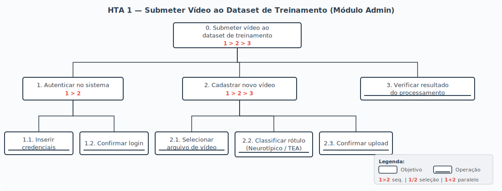

| Objetivos / Operações | Problemas e Recomendações |
| :--- | :--- |
| **0. Submeter vídeo ao dataset de treinamento** `1 > 2 > 3` | **Input:** Arquivo de vídeo de sessão infantil a ser incluído no dataset de treinamento da IA. **Feedback:** Vídeo aparece na lista do dashboard com status "Processado" e rótulo atribuído (Neurotípico ou TEA). **Plano:** Autenticar no sistema, depois cadastrar o novo vídeo, depois verificar o resultado do processamento. **Recomendação:** Permitir upload em lote para otimizar a curadoria de grandes volumes de vídeo. |
| **1. Autenticar no sistema** `1 > 2` | **Plano:** Inserir credenciais e depois confirmar login. |
| **1.1. Inserir credenciais** *(operação)* | **Ação:** Admin digita usuário e senha nos campos do formulário de login. |
| **1.2. Confirmar login** *(operação)* | **Ação:** Sistema valida as credenciais e redireciona para o dashboard. **Feedback:** Dashboard de vídeos do dataset é exibido. **Problema:** Credenciais inválidas não informam se o erro foi no usuário ou na senha. **Recomendação:** Exibir mensagem genérica de erro para segurança, mas com feedback visual claro de que a tentativa falhou. |
| **2. Cadastrar novo vídeo** `1 > 2 > 3` | **Plano:** Selecionar o arquivo de vídeo, depois classificar o rótulo, depois confirmar o upload. |
| **2.1. Selecionar arquivo de vídeo** *(operação)* | **Ação:** Admin clica no botão "+" e seleciona o arquivo de vídeo no explorador de arquivos. **Problema:** O sistema pode aceitar formatos de vídeo incompatíveis com o pipeline de processamento. **Recomendação:** Restringir formatos aceitos (.mp4, .avi) e exibir validação antes do upload. |
| **2.2. Classificar rótulo (Neurotípico / TEA)** *(operação)* | **Ação:** Admin seleciona a classificação do vídeo entre "Neurotípico" ou "TEA" antes de confirmar o envio. **Problema:** Erro de classificação compromete o treinamento do modelo (rótulo errado polui o dataset). **Recomendação:** Permitir edição posterior do rótulo e exigir confirmação explícita da classificação atribuída. |
| **2.3. Confirmar upload** *(operação)* | **Ação:** Admin clica em "Realizar Upload". O sistema inicia o envio e processamento do vídeo. **Feedback:** Barra de progresso durante o upload e mensagem de sucesso ao concluir. **Problema:** Em conexões lentas, o upload pode falhar sem feedback claro. **Recomendação:** Implementar retomada de upload interrompido e indicador de progresso com estimativa de tempo. |
| **3. Verificar resultado do processamento** *(operação)* | **Ação:** Admin visualiza o novo vídeo na lista do dashboard com seu rótulo e status de processamento. **Feedback:** Vídeo listado com status "Processado com sucesso" ou "Erro no processamento". **Problema:** Se o processamento falhar, o admin não sabe se deve tentar novamente ou se o vídeo é incompatível. **Recomendação:** Exibir mensagem de erro detalhada com orientação sobre a causa e próximos passos. |

---

### HTA 2: Submeter Vídeo para Prognóstico Clínico (Módulo Especialista)

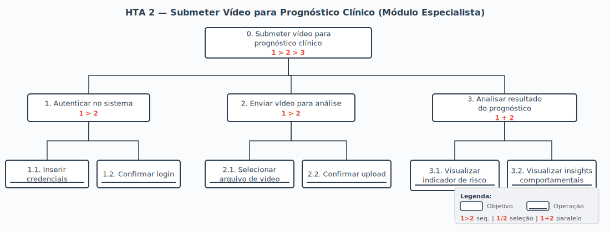

| Objetivos / Operações | Problemas e Recomendações |
| :--- | :--- |
| **0. Submeter vídeo para prognóstico clínico** `1 > 2 > 3` | **Input:** Arquivo de vídeo de sessão gravada com paciente infantil. **Feedback:** Dashboard exibe o vídeo processado com indicador de risco TEA e insights comportamentais detalhados. **Plano:** Autenticar no sistema, depois enviar o vídeo para análise, depois analisar o resultado do prognóstico. **Recomendação:** Notificar o especialista (e-mail ou push) quando o processamento assíncrono for concluído. |
| **1. Autenticar no sistema** `1 > 2` | **Plano:** Inserir credenciais e depois confirmar login. |
| **1.1. Inserir credenciais** *(operação)* | **Ação:** Especialista digita usuário e senha nos campos do formulário de login. |
| **1.2. Confirmar login** *(operação)* | **Ação:** Sistema valida as credenciais e redireciona para o dashboard clínico. **Feedback:** Dashboard de vídeos do especialista é exibido. |
| **2. Enviar vídeo para análise** `1 > 2` | **Plano:** Selecionar o arquivo de vídeo e depois confirmar upload. |
| **2.1. Selecionar arquivo de vídeo** *(operação)* | **Ação:** Especialista clica no botão "+" e seleciona o arquivo de vídeo da sessão no explorador de arquivos. **Problema:** Vídeos de sessões longas podem ser muito pesados, tornando o upload demorado. **Recomendação:** Exibir limite de tamanho antes da seleção e sugerir compressão quando aplicável. |
| **2.2. Confirmar upload** *(operação)* | **Ação:** Especialista clica em "Realizar Upload". O sistema inicia o envio e enfileira o vídeo para processamento pela IA. **Feedback:** Barra de progresso e mensagem informando que o processamento está em andamento. **Problema:** O tempo de processamento da IA pode ser longo e o especialista não sabe quanto tempo falta. **Recomendação:** Exibir estimativa de tempo de processamento e permitir que o especialista continue navegando enquanto aguarda. |
| **3. Analisar resultado do prognóstico** `1 + 2` | **Plano:** Visualizar o indicador de risco TEA e, simultaneamente, visualizar os insights comportamentais. |
| **3.1. Visualizar indicador de risco TEA** *(operação)* | **Ação:** Especialista lê o percentual de probabilidade de risco de TEA gerado pela IA. **Feedback:** Indicador numérico e visual (ex.: gauge ou barra colorida) exibido na tela de resultado. **Problema:** O especialista pode interpretar o indicador como diagnóstico definitivo e não como apoio à decisão. **Recomendação:** Exibir disclaimer explícito de que o indicador é um suporte ao prognóstico, não um diagnóstico. |
| **3.2. Visualizar insights comportamentais** *(operação)* | **Ação:** Especialista analisa gráficos e métricas detalhadas: porcentagem de tempo de olhar mútuo ("Warm"), análise postural, padrões de atenção e outros indicadores. **Feedback:** Dashboard com gráficos interativos, timeline comportamental e destaques visuais sobre o vídeo. **Problema:** Excesso de dados pode sobrecarregar o especialista, dificultando a interpretação. **Recomendação:** Apresentar um resumo executivo com os achados mais relevantes e permitir drill-down nos detalhes sob demanda. |

---

### HTA 3: Consultar Análise de Vídeo Já Processado (Módulo Especialista)

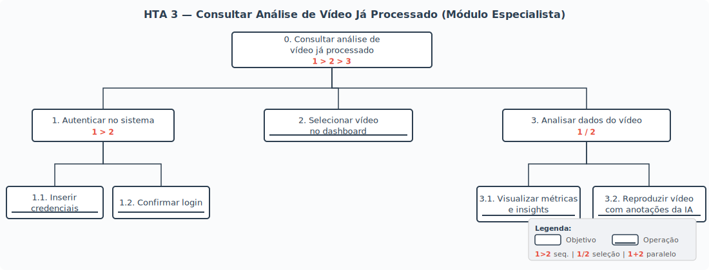

| Objetivos / Operações | Problemas e Recomendações |
| :--- | :--- |
| **0. Consultar análise de vídeo já processado** `1 > 2 > 3` | **Input:** Intenção de revisar dados de um vídeo previamente analisado pela IA. **Feedback:** Dados completos do vídeo selecionado são exibidos na interface. **Plano:** Autenticar no sistema, depois selecionar o vídeo no dashboard, depois analisar os dados do vídeo. |
| **1. Autenticar no sistema** `1 > 2` | **Plano:** Inserir credenciais e depois confirmar login. |
| **1.1. Inserir credenciais** *(operação)* | **Ação:** Especialista digita usuário e senha nos campos do formulário de login. |
| **1.2. Confirmar login** *(operação)* | **Ação:** Sistema valida as credenciais e redireciona para o dashboard clínico. **Feedback:** Dashboard de vídeos do especialista é exibido com a lista de vídeos já processados. |
| **2. Selecionar vídeo no dashboard** *(operação)* | **Ação:** Especialista localiza o vídeo desejado na lista do dashboard e clica sobre ele. **Problema:** Com muitos vídeos cadastrados, localizar um vídeo específico pode ser difícil. **Recomendação:** Implementar busca por nome do paciente, data da sessão ou filtros por status/resultado. |
| **3. Analisar dados do vídeo** `1 / 2` | **Plano:** Visualizar métricas e insights OU reproduzir o vídeo com anotações da IA (dependendo da necessidade do momento). |
| **3.1. Visualizar métricas e insights** *(operação)* | **Ação:** Especialista visualiza o dashboard de dados do vídeo: indicador de risco, gráficos de olhar mútuo, postura, padrões de atenção e demais insights. **Feedback:** Dashboard completo com todas as métricas computadas pela IA. **Problema:** Se o especialista quiser comparar este vídeo com sessões anteriores do mesmo paciente, não há mecanismo de comparação. **Recomendação:** Oferecer funcionalidade de comparação longitudinal entre sessões do mesmo paciente para acompanhar evolução. |
| **3.2. Reproduzir vídeo com anotações da IA** *(operação)* | **Ação:** Especialista reproduz o vídeo processado com sobreposições visuais (bounding boxes, marcações de atenção, face mesh). **Feedback:** Player de vídeo exibe as anotações da IA sincronizadas com a reprodução. **Problema:** Vídeos com muitas anotações podem ficar visualmente poluídos, dificultando a observação do comportamento natural da criança. **Recomendação:** Permitir que o especialista ative/desative camadas de anotação individualmente (ex.: mostrar apenas face mesh, ou apenas marcações de atenção). |

---

### 2) GOMS (Goals, Operators, Methods, Selection Rules)

A seguir são apresentados os modelos GOMS das tarefas principais do sistema GAIA, seguindo a notação de Barbosa e Silva (2010). Para cada tarefa, é apresentada uma versão resumida e uma versão detalhada com operadores primitivos, além da análise KLM (Keystroke-Level Model) para comparação de eficiência.

---

#### GOMS — Tarefa 1: Submeter Vídeo para Prognóstico Clínico (Módulo Especialista)

**Versão Resumida:**

```
GOAL 0: obter prognóstico de TEA para paciente a partir de vídeo de sessão
    GOAL 1: acessar o sistema
        METHOD 1.A: login com credenciais salvas no navegador
            (SEL. RULE: o navegador possui as credenciais salvas e o usuário aceita o preenchimento automático)
        METHOD 1.B: login com digitação manual
            (SEL. RULE: primeiro acesso, ou credenciais não salvas, ou outro computador)
    GOAL 2: cadastrar novo vídeo para análise
        METHOD 2.A: upload por seleção no explorador de arquivos
            (SEL. RULE: o especialista sabe a localização do arquivo no computador)
        METHOD 2.B: upload por arrastar e soltar (drag and drop)
            (SEL. RULE: a janela do explorador de arquivos já está aberta ao lado do navegador)
    GOAL 3: analisar resultado do prognóstico
        GOAL 3.1: interpretar indicador de risco TEA
        GOAL 3.2: interpretar insights comportamentais
```

**Versão Detalhada:**

```
GOAL 0: obter prognóstico de TEA para paciente a partir de vídeo de sessão

    GOAL 1: acessar o sistema

        METHOD 1.A: login com credenciais salvas no navegador
        (SEL. RULE: o navegador possui as credenciais salvas e o usuário aceita o preenchimento automático)
            OP. 1.A.1: deslocar o cursor do mouse para o campo de usuário
            OP. 1.A.2: clicar com o botão esquerdo do mouse para ativar o preenchimento automático
            OP. 1.A.3: selecionar a conta desejada na lista suspensa do navegador
            OP. 1.A.4: deslocar o cursor do mouse para o botão "Entrar"
            OP. 1.A.5: clicar com o botão esquerdo do mouse
            OP. 1.A.6: verificar se o dashboard foi carregado corretamente

        METHOD 1.B: login com digitação manual
        (SEL. RULE: primeiro acesso, ou credenciais não salvas, ou outro computador)
            OP. 1.B.1: deslocar o cursor do mouse para o campo de usuário
            OP. 1.B.2: clicar com o botão esquerdo do mouse
            OP. 1.B.3: digitar o nome de usuário
            OP. 1.B.4: pressionar a tecla Tab para ir ao campo de senha
            OP. 1.B.5: digitar a senha
            OP. 1.B.6: deslocar o cursor do mouse para o botão "Entrar"
            OP. 1.B.7: clicar com o botão esquerdo do mouse
            OP. 1.B.8: verificar se o dashboard foi carregado corretamente

    GOAL 2: cadastrar novo vídeo para análise

        METHOD 2.A: upload por seleção no explorador de arquivos
        (SEL. RULE: o especialista sabe a localização do arquivo no computador)
            OP. 2.A.1: deslocar o cursor do mouse para o botão "+"
            OP. 2.A.2: clicar com o botão esquerdo do mouse
            OP. 2.A.3: aguardar abertura do explorador de arquivos do sistema operacional
            OP. 2.A.4: navegar até a pasta onde o vídeo está salvo
            OP. 2.A.5: selecionar o arquivo de vídeo desejado
            OP. 2.A.6: clicar no botão "Abrir" do explorador de arquivos
            OP. 2.A.7: verificar se o nome do arquivo apareceu na interface
            OP. 2.A.8: deslocar o cursor do mouse para o botão "Realizar Upload"
            OP. 2.A.9: clicar com o botão esquerdo do mouse
            OP. 2.A.10: aguardar processamento pela IA

        METHOD 2.B: upload por arrastar e soltar (drag and drop)
        (SEL. RULE: a janela do explorador de arquivos já está aberta ao lado do navegador)
            OP. 2.B.1: localizar o arquivo de vídeo na janela do explorador de arquivos
            OP. 2.B.2: pressionar o botão esquerdo do mouse sobre o arquivo
            OP. 2.B.3: arrastar o arquivo até a zona de upload na interface do GAIA
            OP. 2.B.4: soltar o botão esquerdo do mouse
            OP. 2.B.5: verificar se o nome do arquivo apareceu na interface
            OP. 2.B.6: deslocar o cursor do mouse para o botão "Realizar Upload"
            OP. 2.B.7: clicar com o botão esquerdo do mouse
            OP. 2.B.8: aguardar processamento pela IA

    GOAL 3: analisar resultado do prognóstico

        GOAL 3.1: interpretar indicador de risco TEA
            OP. 3.1.1: examinar o indicador percentual de probabilidade de risco de TEA
            OP. 3.1.2: examinar a escala visual (gauge ou barra colorida) associada ao indicador

        GOAL 3.2: interpretar insights comportamentais
            OP. 3.2.1: examinar gráfico de porcentagem de tempo de olhar mútuo ("Warm")
            OP. 3.2.2: examinar dados de análise postural
            OP. 3.2.3: examinar demais indicadores de padrões de atenção
            OP. 3.2.4: verificar resumo executivo dos achados mais relevantes
```

---

#### GOMS-KLM — Comparação de Métodos de Upload

Análise comparativa do tempo estimado para o upload de vídeo utilizando os dois métodos disponíveis, conforme o modelo KLM (Keystroke-Level Model).

**METHOD 2.A — Upload por seleção no explorador de arquivos:**

| Operador | Descrição | Tempo (s) |
| :--- | :--- | :--- |
| M | Preparação mental (decidir fazer upload) | 1,20 |
| P | Levar o cursor até o botão "+" | 1,10 |
| B | Pressionar o botão do mouse | 0,10 |
| B | Soltar o botão do mouse | 0,10 |
| R | Aguardar abertura do explorador de arquivos | 1,00 |
| M | Preparação mental (localizar a pasta) | 1,20 |
| P | Navegar e selecionar o arquivo | 1,10 |
| B | Pressionar o botão do mouse (selecionar) | 0,10 |
| B | Soltar o botão do mouse | 0,10 |
| P | Levar o cursor até "Abrir" | 1,10 |
| B | Pressionar o botão do mouse | 0,10 |
| B | Soltar o botão do mouse | 0,10 |
| M | Preparação mental (confirmar upload) | 1,20 |
| P | Levar o cursor até "Realizar Upload" | 1,10 |
| B | Pressionar o botão do mouse | 0,10 |
| B | Soltar o botão do mouse | 0,10 |
| | **TOTAL** | **9,80** |

**METHOD 2.B — Upload por arrastar e soltar (drag and drop):**

| Operador | Descrição | Tempo (s) |
| :--- | :--- | :--- |
| M | Preparação mental (decidir fazer upload) | 1,20 |
| P | Levar o cursor até o arquivo no explorador | 1,10 |
| B | Pressionar o botão do mouse (segurar) | 0,10 |
| P | Arrastar até a zona de upload do GAIA | 1,10 |
| B | Soltar o botão do mouse | 0,10 |
| M | Preparação mental (confirmar upload) | 1,20 |
| P | Levar o cursor até "Realizar Upload" | 1,10 |
| B | Pressionar o botão do mouse | 0,10 |
| B | Soltar o botão do mouse | 0,10 |
| | **TOTAL** | **6,10** |

**Conclusão KLM:** O método de drag and drop (6,10s) é **37,8% mais rápido** que o método de seleção via explorador (9,80s), pois elimina a abertura do explorador de arquivos e a navegação de pastas. No entanto, a regra de seleção indica que ele só é viável quando a janela do explorador já está aberta ao lado do navegador.

---

#### GOMS — Tarefa 2: Consultar Análise de Vídeo Já Processado (Módulo Especialista)

**Versão Resumida:**

```
GOAL 0: consultar análise de vídeo já processado para fundamentar laudo
    GOAL 1: acessar o sistema
        METHOD 1.A: login com credenciais salvas no navegador
            (SEL. RULE: o navegador possui as credenciais salvas)
        METHOD 1.B: login com digitação manual
            (SEL. RULE: credenciais não salvas ou outro computador)
    GOAL 2: localizar o vídeo desejado
        METHOD 2.A: buscar pelo nome do paciente ou data
            (SEL. RULE: o especialista sabe o nome do paciente ou a data da sessão)
        METHOD 2.B: navegar pela lista do dashboard
            (SEL. RULE: o vídeo foi processado recentemente e deve estar no topo da lista)
    GOAL 3: analisar dados do vídeo
        METHOD 3.A: visualizar métricas e insights no dashboard
            (SEL. RULE: o especialista precisa de dados quantitativos para o laudo)
        METHOD 3.B: reproduzir vídeo com anotações da IA
            (SEL. RULE: o especialista precisa revisar visualmente o comportamento da criança)
```

**Versão Detalhada:**

```
GOAL 0: consultar análise de vídeo já processado para fundamentar laudo

    GOAL 1: acessar o sistema
        (métodos 1.A e 1.B idênticos à Tarefa 1)

    GOAL 2: localizar o vídeo desejado

        METHOD 2.A: buscar pelo nome do paciente ou data
        (SEL. RULE: o especialista sabe o nome do paciente ou a data da sessão)
            OP. 2.A.1: deslocar o cursor do mouse para o campo de busca
            OP. 2.A.2: clicar com o botão esquerdo do mouse
            OP. 2.A.3: digitar o nome do paciente ou data da sessão
            OP. 2.A.4: pressionar Enter ou clicar no ícone de busca
            OP. 2.A.5: verificar resultados retornados
            OP. 2.A.6: clicar sobre o vídeo desejado na lista de resultados

        METHOD 2.B: navegar pela lista do dashboard
        (SEL. RULE: o vídeo foi processado recentemente e deve estar no topo da lista)
            OP. 2.B.1: examinar a lista de vídeos no dashboard
            OP. 2.B.2: deslocar o cursor do mouse para o vídeo desejado
            OP. 2.B.3: clicar com o botão esquerdo do mouse sobre o vídeo

    GOAL 3: analisar dados do vídeo

        METHOD 3.A: visualizar métricas e insights no dashboard
        (SEL. RULE: o especialista precisa de dados quantitativos para o laudo)
            OP. 3.A.1: examinar indicador percentual de risco TEA
            OP. 3.A.2: examinar gráfico de tempo de olhar mútuo ("Warm")
            OP. 3.A.3: examinar dados de análise postural
            OP. 3.A.4: examinar padrões de atenção e demais insights
            OP. 3.A.5: examinar resumo executivo dos achados

        METHOD 3.B: reproduzir vídeo com anotações da IA
        (SEL. RULE: o especialista precisa revisar visualmente o comportamento da criança)
            OP. 3.B.1: deslocar o cursor do mouse para o botão "Play" do player de vídeo
            OP. 3.B.2: clicar com o botão esquerdo do mouse
            OP. 3.B.3: observar o vídeo com as sobreposições da IA (bounding boxes, face mesh)
            OP. 3.B.4: pausar e retroceder conforme necessário para análise detalhada
            OP. 3.B.5: verificar se as anotações da IA correspondem à percepção clínica
```

---

### 3) CTT (ConcurTaskTrees)

A seguir são apresentados os modelos CTT das tarefas do GAIA utilizando a notação de Barbosa e Silva (2010), com os 4 tipos de tarefa e as relações temporais entre elas.

---

#### CTT — Tarefa 1: Submeter Vídeo para Prognóstico Clínico

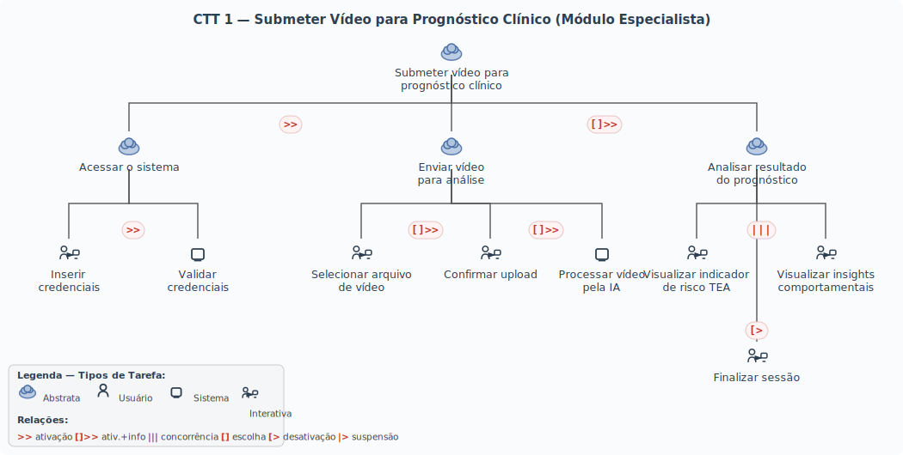

**Explicação das relações utilizadas:**

- **Identificar necessidade de análise `>>` Submeter e processar vídeo:** ativação — a especialista primeiro identifica a necessidade clínica de analisar o paciente (tarefa do usuário, fora do sistema), e só então inicia a interação com o GAIA.
- **Autenticar `>>` Selecionar arquivo:** ativação — o upload só pode ser feito após a autenticação.
- **Selecionar arquivo `[]>>` Confirmar upload:** ativação com passagem de informação — o arquivo selecionado é passado para a etapa de confirmação.
- **Confirmar upload `[]>>` Processar vídeo:** ativação com passagem de informação — o vídeo enviado é passado ao pipeline de IA para processamento.
- **Submeter e processar `[]>>` Analisar resultado:** ativação com passagem de informação — os dados processados pela IA são passados para a tela de resultado.
- **Visualizar indicador `|||` Visualizar insights:** concorrência — o especialista pode examinar o indicador de risco e os gráficos de insights em qualquer ordem ou simultaneamente na mesma tela.
- **Analisar resultado `[]>>` Interpretar resultados para o laudo:** ativação com passagem de informação — após visualizar os dados do sistema, a especialista realiza a interpretação clínica (tarefa do usuário, fora do sistema) para incorporar os achados ao laudo.

---

#### CTT — Tarefa 2: Consultar Análise de Vídeo Já Processado

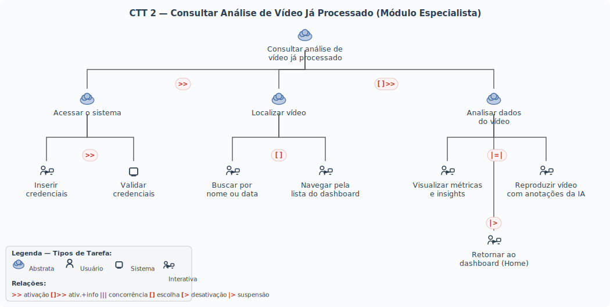

**Explicação das relações utilizadas:**

- **Decidir consultar dados para o laudo `>>` Acessar e localizar vídeo:** ativação — a especialista primeiro decide que precisa revisar dados de um caso (tarefa do usuário, fora do sistema), e só então acessa o GAIA.
- **Autenticar `>>` Localizar vídeo:** ativação — a navegação só ocorre após autenticação.
- **Buscar por nome/data `[]` Navegar pela lista:** escolha — o especialista utiliza a busca OU a navegação manual; uma vez iniciado um método, o outro fica desabilitado naquela ação.
- **Acessar e localizar `[]>>` Analisar dados:** ativação com passagem de informação — o vídeo selecionado é passado para a tela de análise detalhada.
- **Visualizar métricas `|=|` Reproduzir vídeo:** independência — o especialista pode realizar as duas atividades em qualquer ordem, mas quando inicia uma, precisa concluí-la antes de focar na outra.
- **Analisar dados `[]>>` Consolidar percepção clínica:** ativação com passagem de informação — após interagir com os dados do sistema, a especialista consolida sua percepção clínica sobre o caso (tarefa do usuário, fora do sistema) para embasar o laudo.

---

## 📝 Entrega 6: Prototipação de Baixa Fidelidade

### Tela 01 — Login
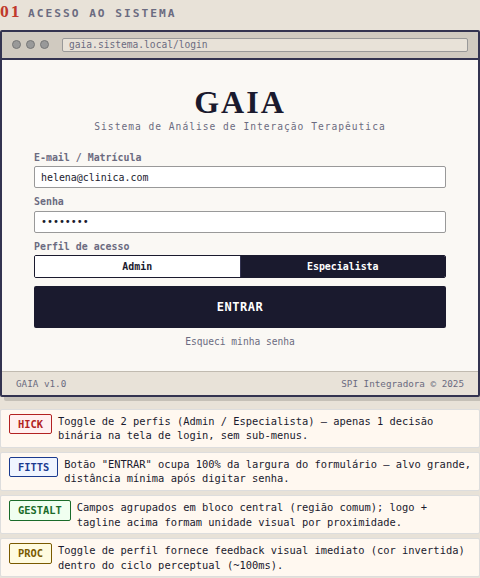

### Tela 02 — Dashboard Admin
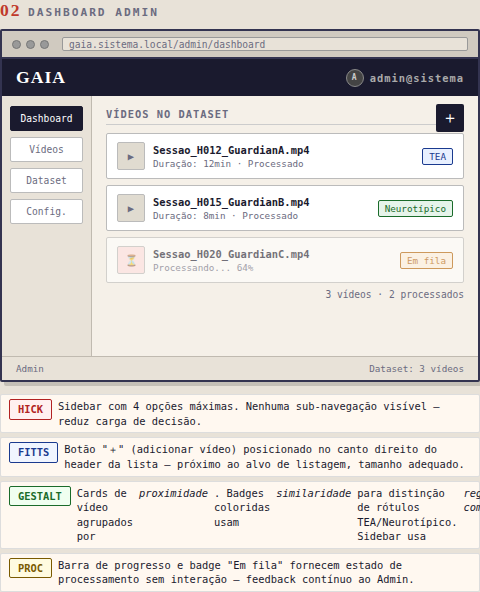

### Tela 03 — Upload: Seleção de Arquivo
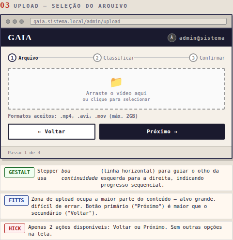

### Tela 04 — Upload: Classificação
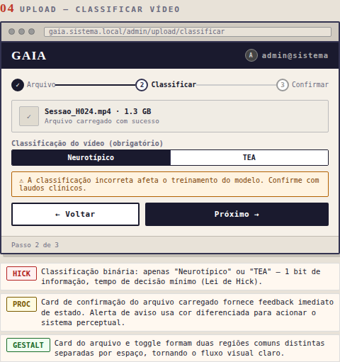

### Tela 05 — Upload: Confirmação
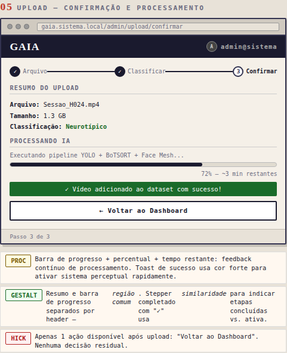

### Tela 06 — Dashboard Especialista
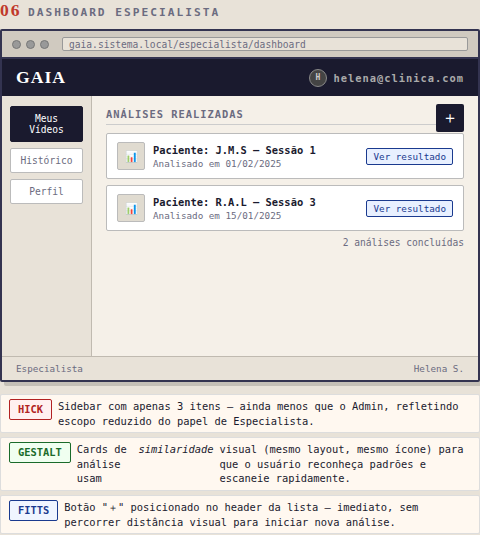

### Tela 07 — Upload Especialista
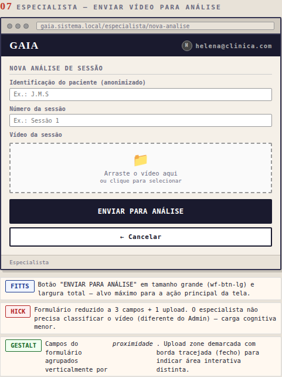

### Tela 08 — Resultado do Prognóstico
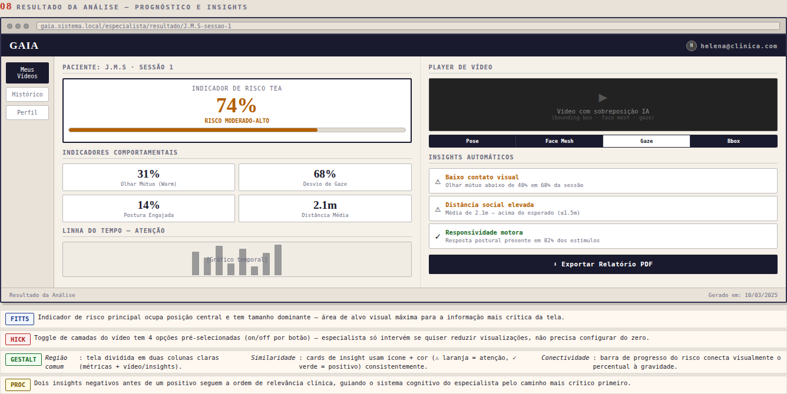

---

## 📋 Entrega 7: Requisitos e Ética
*Status: Concluído*

---

### 1) Identificação de Necessidades e Requisitos

#### Que dados coletar?

Os dados necessários para o desenvolvimento e validação do sistema GAIA são de natureza **comportamental e cinesiológica**, extraídos de sessões de interação entre guardião e criança. São eles:

| Dado | Descrição | Como é obtido |
| :--- | :--- | :--- |
| **Direção do olhar (gaze)** | Estimativa do vetor de direção do olhar de cada participante, inferida a partir de landmarks iris via MediaPipe Face Mesh | Processamento computacional de visão (frame a frame) |
| **Pose corporal** | Posição das articulações-chave (ombros, quadril, membros) de cada participante | YOLOv8-Pose + BoTSORT |
| **Distância interpessoal** | Distância euclidiana estimada entre os bounding boxes de guardião e criança ao longo do tempo | Cálculo geométrico a partir de coordenadas de detecção |
| **Frequência de olhar mútuo** | Percentual de frames em que ambos os participantes apresentam vetores de gaze convergentes | Derivado das métricas de gaze |
| **Identidade de papel** | Classificação automática dos indivíduos detectados nos papéis de "Guardião" e "Criança" | Par-based prescan por tamanho relativo + BH cross-check |
| **Rótulo clínico do vídeo** | Classificação binária da sessão como Neurotípico ou TEA, atribuída no ato do upload pelo Admin | Fornecido pelo clínico responsável da UNSW |

#### De quem coletar?

Os dados foram coletados junto a **díades guardião-criança** recrutadas pelo *Perinatal and Children's Research Centre (PCRC)* da **University of New South Wales (UNSW), Sydney, Austrália**. O dataset é composto por **10 vídeos** de sessões de interação lúdica estruturada, com duração média de ~30 minutos cada, resolução 1280×720 a 24 FPS.

Os participantes incluem:

* **Crianças** com diagnóstico confirmado de Transtorno do Espectro Autista (TEA) e crianças com desenvolvimento neurotípico, na faixa etária de 2 a 6 anos;
* **Guardiões** (pais ou responsáveis legais) presentes durante as sessões.

---

### 2) Aspectos Éticos

O uso dos dados neste projeto está integralmente amparado por aprovação ética institucional formal, conforme descrito a seguir.

#### Aprovação do Comitê de Ética — UNSW

A coleta e o uso dos vídeos foram aprovados pelo **Human Research Ethics Committee (HREC)** da *University of New South Wales*, órgão competente para deliberar sobre pesquisas envolvendo participantes humanos no contexto australiano. A aprovação cobre:

* Coleta de imagens de crianças menores de idade em ambiente clínico controlado;
* Uso dos vídeos para fins de pesquisa em análise computacional do comportamento;
* Compartilhamento dos dados com pesquisadores parceiros, sob acordo de colaboração entre a UNSW e o Centro Universitário FEI (Brasil).

O acesso ao dataset foi viabilizado pela parceria entre o orientador deste projeto e os pesquisadores do **PCRC/UNSW**, que autorizaram formalmente a utilização do material para desenvolvimento e validação do sistema GAIA no contexto do TCC.

#### Privacidade e Anonimização

Dado que o dataset envolve imagens de crianças — categoria de dado pessoal sensível sob qualquer legislação —, as seguintes salvaguardas são adotadas:

| Medida | Descrição |
| :--- | :--- |
| **Identificação anonimizada** | Os vídeos são referenciados por código alfanumérico (ex.: `Sessao_H012`), sem nome, data de nascimento ou qualquer dado que permita identificação direta dos participantes |
| **Armazenamento local** | O dataset é armazenado em ambiente local controlado, sem upload para serviços de nuvem públicos |
| **Acesso restrito** | O acesso aos vídeos é limitado exclusivamente ao pesquisador responsável (o autor deste TCC) e ao orientador |
| **Não reutilização** | Os vídeos não serão utilizados para nenhuma finalidade além da descrita neste trabalho, em conformidade com os termos da aprovação ética da UNSW |

#### Conformidade com a LGPD (Lei nº 13.709/2018)

Embora a coleta tenha ocorrido na Austrália sob aprovação do HREC/UNSW, o processamento dos dados ocorre no Brasil, sujeitando-se também à **Lei Geral de Proteção de Dados Pessoais (LGPD)**. A base legal aplicável é o **Art. 7º, inciso IV** (pesquisa científica), observados os princípios de finalidade, necessidade e segurança previstos nos Arts. 6º e 46 da mesma lei.

---

### 3) Ferramentas de Coleta de Dados

A coleta de dados deste projeto **não foi conduzida diretamente pelos autores**. O dataset foi obtido por meio de **cessão institucional formal** entre o PCRC/UNSW e o Centro Universitário FEI, viabilizada pela atuação do orientador deste trabalho como pesquisador vinculado a ambas as instituições.

| Item | Descrição |
| :--- | :--- |
| **Instrumento** | Dataset de vídeos de sessões terapêuticas cedido pelo PCRC/UNSW |
| **Procedimento de coleta original** | Sessões de interação lúdica estruturada entre guardião e criança, filmadas em ambiente clínico controlado (sala de terapia com câmera fixa, iluminação padronizada) |
| **Equipamento de captação** | Câmera fixa com resolução 1280×720 a 24 FPS |
| **Volume** | 10 vídeos, ~30 minutos cada (~5 horas de material bruto) |
| **Acesso** | Autorizado via acordo de colaboração entre UNSW e FEI, com aprovação prévia do HREC/UNSW |
| **Formato entregue** | Arquivos de vídeo digitais acompanhados de metadados clínicos (rótulo Neurotípico/TEA por sessão) fornecidos pelos clínicos responsáveis da UNSW |

> **Nota:** Em razão da natureza institucional da cessão de dados, não há questionário, formulário de consentimento próprio ou roteiro de entrevista produzido por este projeto. O consentimento dos participantes foi obtido diretamente pela equipe da UNSW no momento da coleta original, conforme exigido pelo HREC.

---

## 🔄 Entrega 8: Engenharia de Usabilidade
*Status: [Em andamento]*

### 1. Características da Plataforma
| Característica | Descrição |
| :--- | :--- |
| **Descrição do Software** | [Web/Desktop, Linguagem, etc] |
| **Descrição do Hardware** | [Requisitos mínimos, Câmera, Processamento] |
| **Capacidades** | [O que o sistema consegue fazer] |
| **Restrições** | [Limitações técnicas ou de ambiente] |

### 2. Princípios Gerais do Projeto (Legislação e Normas)

| Nome | Descrição | Link | Descrição do Contexto no Projeto |
| :--- | :--- | :--- | :--- |
| **LGPD (Lei 13.709/2018)** | Lei que regulamenta o tratamento de dados pessoais no Brasil. | [Planalto](https://www.planalto.gov.br/ccivil_03/_ato2015-2018/2018/lei/l13709.htm) | Estabelece regras sobre coleta e proteção dos vídeos e dados dos pacientes (crianças). |
| **Lei da Acessibilidade (10.098/2000)** | Normas gerais e critérios básicos para a promoção da acessibilidade. | [Planalto](https://www.planalto.gov.br/ccivil_03/leis/l10098.htm) | Diretrizes para tornar a interface acessível a profissionais com deficiência. |
| **ABNT NBR ISO 9241** | Ergonomia da interação humano-sistema. | - | Princípios de design centrado no usuário para garantir usabilidade. |

### 3. Metas de Usabilidade
| Metas (Qualitativo/Quantitativo) | Porcentagem | Justificativa |
| :--- | :--- | :--- |
| **Facilidade de Aprendizado** | [X]% | [Motivo] |
| **Eficiência de Uso** | [X]% | [Motivo] |
| **Prevenção de Erros** | [X]% | [Motivo] |
| **TOTAL** | **100%** | |

---

## 🎭 Entrega 9: Cenários de Interação e Design
*Status: [Em andamento]*

### 1) Cenários de Interação
> [Reescrita do cenário problema, agora incluindo a interação com a solução GAIA]

### 2) Design Centrado na Comunicação (Diálogos)
| Tópico > Subtópico | Falas e Signos (U=Usuário, S=Sistema) |
| :--- | :--- |
| U: Preciso... | U: [Ação] |
| > | S: [Resposta/Tela] |

### 3) Mapa de Objetivos
> [Inserir diagrama]

### 4) Esquema Conceitual de Signos
| Signo | Origem | Tipo Conteúdo | Restrição | Prevenção | Recuperação |
| :--- | :--- | :--- | :--- | :--- | :--- |
| **Usuário** | Domínio | Texto | Não nulo | Campo Obrigatório | Mensagem de erro |
| **Vídeo** | Domínio | Arquivo | .mp4, .avi | Formato inválido | Re-upload |

---

## 🗺️ Entrega 10: Diagrama MOLIC
*Status: [Em andamento]*

### Diagrama de Interação
> [Inserir imagem do diagrama MOLIC desenhado]

---

## 🎨 Entrega 11: Protótipo de Alta Fidelidade
*Status: [Em andamento]*

### Link para o Figma
> [Inserir Link Aqui]

*(Inserir alguns prints das telas principais aqui no README)*

---

## 📊 Entrega 12: Planejamento de Usabilidade (DECIDE)
*Status: [Em andamento]*

### a) Planejamento (DECIDE)
* **D (Determinar):** Objetivos da avaliação.
* **E (Explorar):** Perguntas a serem respondidas.
* **C (Escolher):** Métodos de avaliação.
* **I (Identificar):** Questões práticas (participantes, equipamentos).
* **D (Decidir):** Como lidar com questões éticas.
* **E (Avaliar):** Como analisar os dados.

### b) Lista de Instrumentos
* [ ] Termo de Consentimento Livre e Esclarecido (TCLE)
* [ ] Roteiro de Tarefas
* [ ] Questionário Pós-Teste

---

## 🧐 Entrega 13: Avaliação Heurística
*Status: [Em andamento]*

### A) Violações Encontradas (Heurísticas de Nielsen)

| ID | Heurística Violada | Descrição do Problema | Grau de Severidade (0-4) | Local (Tela) |
| :--- | :--- | :--- | :--- | :--- |
| 1 | [Ex: Visibilidade do Status] | [O sistema não avisa quando o upload termina] | 3 (Grave) | Tela de Upload |

*Legenda Severidade:*
* 0: Sem importância
* 1: Cosmético
* 2: Simples
* 3: Grave
* 4: Catastrófico

### B) Boas Práticas (Exemplos de Sucesso)
> [Print de uma tela onde uma heurística foi muito bem aplicada]

---

## 🧪 Entrega 14: Avaliação por Observação
*Status: [Em andamento]*

### A) Fluxograma de Avaliação
> [Imagem do fluxo]

### B) Procedimento de Preparação
1.  Recrutamento.
2.  Setup do ambiente.
3.  Lista de Tarefas.

### C) Resultados do Teste (Exemplo de Tabela)
| Tarefa | Grau de Sucesso | Erros Cometidos | Tempo | Grau de Satisfação |
| :--- | :--- | :--- | :--- | :--- |
| **1. Fazer Upload** | Sucesso Total | 0 | 10s | Alto |
| **2. Gerar Relatório** | Sucesso Parcial | 1 (Confusão no botão) | 45s | Médio |

### Conclusão da Avaliação
> [Síntese dos resultados]

---
*Documentação gerada para a disciplina de Interface Humano-Computador (IHC) - 2026.*


