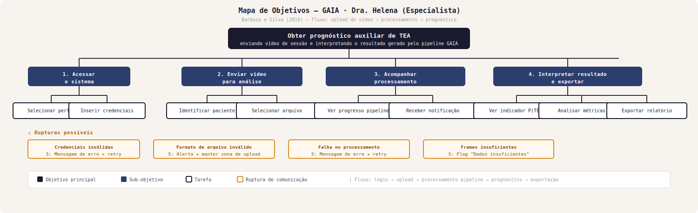
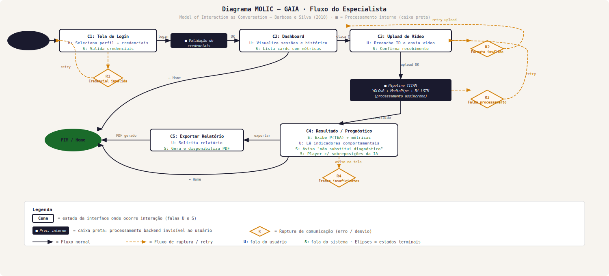
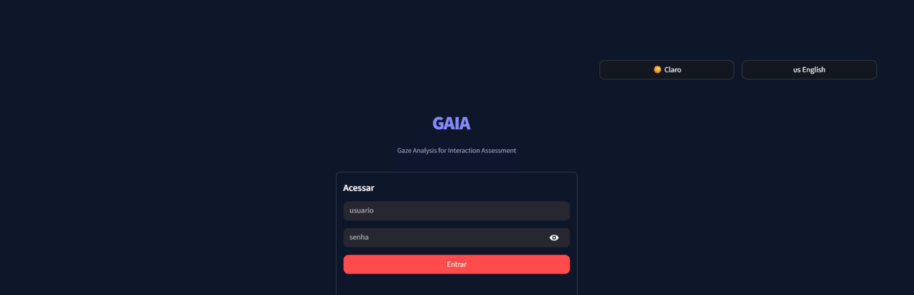
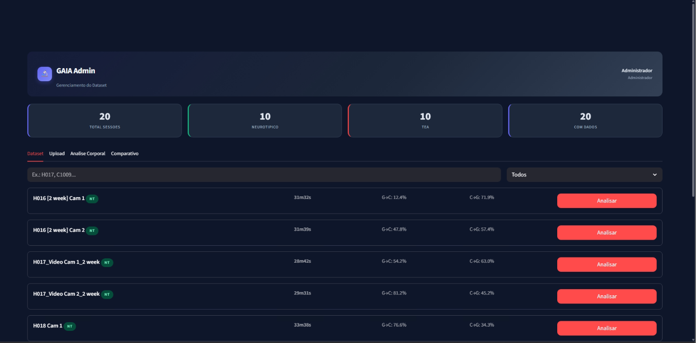
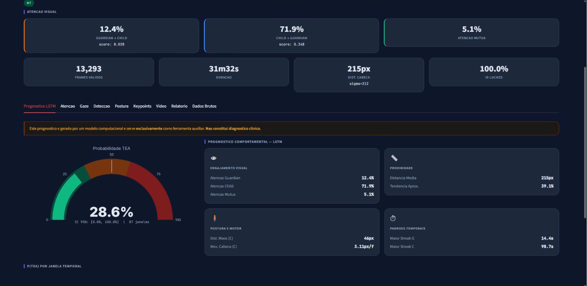
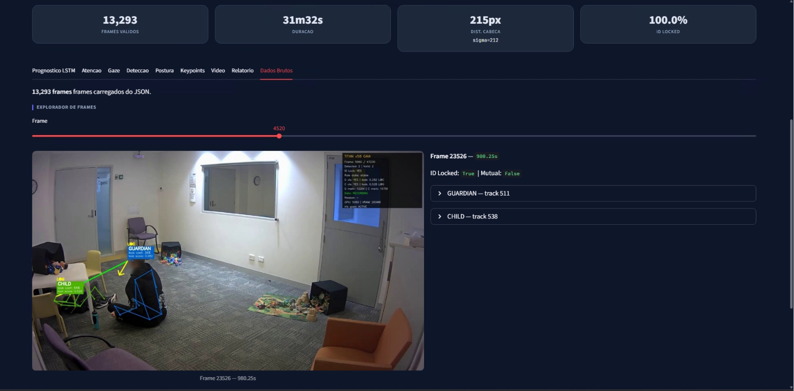
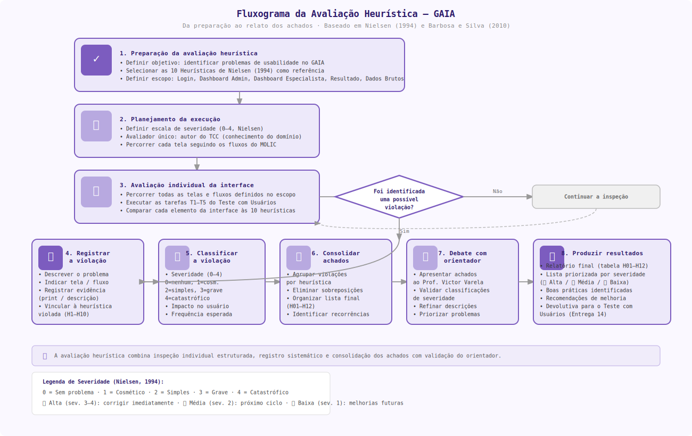

# 🧬 Projeto GAIA - Documentação de IHC

**Projeto:** GAIA (Visualização Computacional para Apoio ao Prognóstico de TEA)  
**Disciplina:** Interface Humano-Computador (IHC)  
**Semestre:** 2026

---

## 🗂️ Índice

| # | Entrega | Status |
| :-: | :--- | :-: |
| [1](#-entrega-1-conhecendo-o-problema-definição-do-escopo) | Conhecendo o Problema (Definição do Escopo) | ✅ |
| [2](#-entrega-2-análise-de-concorrência-soluções-análogas) | Análise de Concorrência (Soluções Análogas) | ✅ |
| [3](#-entrega-3-personas-e-contexto) | Personas e Contexto | ✅ |
| [4](#️-entrega-4-cenários-de-análise-problema) | Cenários de Análise (Problema) | ✅ |
| [5](#️-entrega-5-análise-de-tarefas) | Análise de Tarefas (HTA, GOMS, CTT) | ✅ |
| [6](#-entrega-6-prototipação-de-baixa-fidelidade) | Prototipação de Baixa Fidelidade | ✅ |
| [7](#-entrega-7-requisitos-e-ética) | Requisitos e Ética | ✅ |
| [8](#-entrega-8-engenharia-de-usabilidade) | Engenharia de Usabilidade | ✅ |
| [9](#-entrega-9-cenários-de-interação-e-design) | Cenários de Interação e Design | ✅ |
| [10](#️-entrega-10-diagrama-molic) | Diagrama MOLIC | ✅ |
| [11](#-entrega-11-protótipo-de-alta-fidelidade) | Protótipo de Alta Fidelidade | ✅ |
| [12](#-entrega-12-planejamento-da-avaliação-de-ihc-decide) | Planejamento de Usabilidade (DECIDE) | ✅ |
| [13](#-entrega-13-avaliação-heurística) | Avaliação Heurística | ✅ |
| [14](#-entrega-14-avaliação-por-observação) | Avaliação por Observação | ✅ |

---

## 👥 Membros da Equipe

| Nome Completo | Matrícula |
| :--- | :--- |
| **Gabriel Balbine de Andrades** | 22.222.001-4 |

---

## 🚀 Entrega 1: Conhecendo o Problema (Definição do Escopo)
*Status: Concluído*

### 1.1) Membros de Equipe
*(Ver tabela acima)*

### 1.2) Título Original do TCC
> *ANÁLISE DE PADRÕES COMPORTAMENTAIS NO TEA: DESAFIOS DIAGNÓSTICOS E NOVAS FERRAMENTAS TECNOLÓGICAS*

### 1.3) Nome do Orientador
* Prof. Dr. Victor Perrone de Lima Varela

### 1.4) Previsto desenvolver Interface?
- [x] Sim

### 1.5) Objetivo do trabalho?
Desenvolver uma solução tecnológica para **auxílio ao prognóstico**, processando vídeos de interações sociais para identificar padrões comportamentais típicos do espectro autista (como falta de contato visual e atenção compartilhada), fornecendo dados quantitativos para embasar a decisão médica.

### 1.6) Qual o produto final?
Um sistema desktop/web dividido em dois módulos distintos:
1. **Módulo Admin (Dataset):** Para curadoria, ingestão de vídeos e refinamento do treinamento da IA.
2. **Módulo Especialista (Clínico):** Para upload de vídeos de pacientes, análise pós-processada e visualização de dashboards de risco.

### 1.7) Quem é o usuário final deste produto?
Exclusivamente profissionais da saúde mental e pesquisadores:
* Psiquiatras
* Psicólogos / Neuropsicólogos
* Pesquisadores da área de neurodesenvolvimento

### 1.8) O que o usuário recebe de benefício ao usar esse produto?
O profissional ganha uma "segunda opinião" técnica baseada em métricas. A ferramenta destaca comportamentos sutis em vídeos (que poderiam passar despercebidos a olho nu) e gera um indicador de risco, servindo como um filtro objetivo para apoiar a elaboração do laudo clínico e justificar a necessidade de investigação aprofundada.

### 1.9) Quais as funcionalidades da ferramenta (visão do usuário)?
**Módulo Admin:**
* Ingestão de novos vídeos para o Dataset.
* Rotulagem e retreinamento do modelo.

**Módulo Especialista:**
* Upload de vídeos (análise assíncrona pelo pipeline TITAN).
* Visualização do vídeo processado com sobreposições da IA (detecção de pose, estimativa de gaze).
* **Dashboard de Insights:** Métricas de atenção visual, proximidade interpessoal e postura corporal.
* **Output de Decisão:** Indicador probabilístico de risco de TEA (P(TEA)) como ferramenta auxiliar ao prognóstico clínico.

### 1.10) Quais tecnologias e ferramentas computacionais pretendem usar?
* **Backend/IA:** Python, YOLOv8 (detecção e pose), MediaPipe (Face Mesh/Iris), BoTSORT (rastreamento), PyTorch (Bi-LSTM).
* **Interface:** Aplicação web local (HTML/CSS/JS), servida via localhost.
* **Infraestrutura:** Processamento local, sem envio de dados para servidores externos (conformidade LGPD).

### 1.11) Qual é o contexto de uso dessa aplicação?
* **Ambiente:** Consultórios terapêuticos ou laboratórios de pesquisa (ambiente controlado).
* **Dinâmica:** Uso **assíncrono**. O profissional grava a sessão e submete o vídeo ao software posteriormente. A análise ocorre em segundo plano enquanto o especialista continua suas atividades.

---

## 🔍 Entrega 2: Análise de Concorrência (Soluções Análogas)
*Status: Concluído*

### 1) Público Alvo
O sistema é destinado a **profissionais de saúde mental e pesquisadores** (Psiquiatras, Psicólogos, Neuropsicólogos) que buscam ferramentas de apoio à decisão clínica baseadas em evidências visuais quantitativas.

### 2) Análise de Concorrência

#### A. Principais Concorrentes (Referências de Interação)
| Nome | Área | Link | Descrição da Solução |
| :--- | :--- | :--- | :--- |
| **Aidoc** | Radiologia (IA) | [aidoc.com](https://www.aidoc.com/) | Plataforma de IA para radiologia que analisa imagens médicas (TC/Raio-X) para identificar anomalias agudas. Funciona como sistema de triagem e priorização de lista de trabalho. |
| **Viz.ai** | Neurovascular (AVC) | [viz.ai](https://www.viz.ai/) | Utiliza IA para detectar sinais de AVC em tomografias e alerta a equipe médica em tempo real via aplicativo móvel, sincronizando o fluxo de cuidado. |
| **Lunit INSIGHT** | Oncologia | [lunit.io](https://www.lunit.io/) | Analisa imagens de Raio-X de tórax e mamografias para detectar nódulos e câncer, fornecendo pontuação de anormalidade e mapas de calor sobre a imagem. |


> **Nota de reprodutibilidade:** As imagens dos concorrentes estão versionadas localmente em `./assets/concorrencia/`. Caso os arquivos não estejam presentes, fazer download manual dos prints e salvá-los nos caminhos indicados acima.

#### B. Características e funcionalidades
* **Triagem Automatizada ("Always-on AI"):** (Aidoc/Viz.ai) O sistema monitora o fluxo de imagens automaticamente, sem necessidade de clique manual.
* **Alertas Móveis:** (Viz.ai) Envia notificações críticas para o smartphone do médico, permitindo visualização rápida da imagem processada.
* **Mapas de Calor (Heatmaps):** (Lunit) A IA colore a região suspeita com um mapa de calor, ajudando o médico a focar sua atenção na área correta.
* **Score de Probabilidade:** (Todos) Fornecem uma porcentagem de certeza ou "grau de risco" para cada caso analisado.

#### C. Experiência do usuário (UX) e Opiniões
* **Explicação Visual (Explainability):** A sobreposição visual (overlays) valida a decisão da máquina — o médico vê a imagem original com as anotações da IA por cima (bounding boxes ou cores).
* **Priorização:** Em vez de analisar exames em ordem cronológica, a interface reorganiza a lista colocando os casos críticos no topo.
* **Simplicidade:** Interfaces limpas, geralmente em modo escuro (Dark Mode) para destacar o contraste das imagens médicas.

#### D. Padrões e tendências de mercado observadas
* **Suporte à Decisão (CDSS):** Consenso de mercado de que a IA é um "copiloto". A palavra final e o laudo são sempre humanos.
* **Visualização Mobile:** Tendência forte de permitir que o médico veja os resultados preliminares da IA no celular para agilizar a triagem.
* **Integração PACs:** As ferramentas injetam seus resultados diretamente nos visualizadores de imagem que os médicos já usam no dia a dia.

---

# 👤 Entrega 3: Personas e Contexto
*Status: Concluído*

## 1. Personas

### Persona Primária: Dra. Helena Souza
> **"A tecnologia deve ser uma lente de aumento para a intuição clínica."**

#### 1. Identidade
* **Nome:** Helena Souza
* **Idade:** 42 anos
* **Bio:** Possui doutorado em Psicologia Clínica com foco em TEA. Trabalha em clínica particular e Hospital Universitário há 15 anos. É extremamente técnica, mas sente o peso da rotina manual.

#### 2. Status
* **Papel:** Neuropsicóloga Infantil e Pesquisadora / Persona Primária
* **Nível de Influência:** Decisora (ela escolhe as ferramentas que usa).
* **Perfil Tecnológico:** Usuária Intermediária. Domina prontuários eletrônicos e Office, mas não sabe programar.

#### 3. Objetivos
* Reduzir a subjetividade ("achismo") na avaliação do contato visual.
* Obter métricas quantitativas precisas para embasar seus laudos.
* **Pessoal:** Otimizar o tempo burocrático para conseguir jantar com a família e descansar.

#### 4. Habilidades
* **Especialidade:** Expert em comportamento infantil e diagnóstico de TEA.
* **Competências:** Alta capacidade analítica clínica; Leitura de gráficos; Dificuldade com configurações técnicas complexas (instalação via terminal).

#### 5. Tarefas
* **Diárias:** Realizar sessões lúdicas e gravar vídeos; Revisar vídeos manualmente (ponto crítico).
* **Semanais:** Escrever laudos de evolução e dar devolutivas aos pais.

#### 6. Relacionamentos
* **Família (Marido e 2 filhos):** Motivação pessoal para buscar agilidade no trabalho.
* **Pacientes e Pais:** Foco de sua empatia profissional.
* **Colegas e Suporte de TI:** Interações pontuais na clínica.

#### 7. Requisitos
* **Interface:** Deve ser visual e intuitiva ("clicar e arrastar").
* **Performance:** Processamento em segundo plano sem travar o PC.
* **Segurança:** Sigilo absoluto dos vídeos.

#### 8. Expectativas
* Espera que o GAIA funcione como um "assistente residente" que faz o trabalho braçal.
* Espera que o sistema confirme sua intuição com dados concretos.

> **Nota metodológica:** O projeto optou por trabalhar com uma única persona primária em razão do escopo do produto, que atende a um perfil de usuário bem delimitado — especialistas clínicos com experiência em TEA, atuando de forma assíncrona em ambiente controlado. A ausência de persona secundária foi uma decisão fundamentada no perfil homogêneo do público-alvo identificado na Entrega 1 e confirmado pelo levantamento de requisitos da Entrega 7. Conforme Barbosa e Silva (2010), personas secundárias podem ser omitidas quando o sistema foi projetado para um grupo de usuários suficientemente coeso.

---

## 2. Mapa de Empatia (Dra. Helena)

| **O que ela VÊ?** | **O que ela OUVE?** |
| :--- | :--- |
| • Crianças com dificuldade de interação.<br>• Pais ansiosos por diagnósticos rápidos.<br>• Pilhas de anotações manuais.<br>• Colegas médicos usando IA em radiologia. | • Perguntas dos pais: "Ele melhorou mesmo?".<br>• O barulho da criança na sessão.<br>• Reclamações da família: "Você está trabalhando até tarde de novo?".<br>• Palestras sobre inovação na saúde. |
| **O que ela FALA e FAZ?** | **O que ela PENSA e SENTE?** |
| • Grava sessões no tripé.<br>• Assiste vídeos de madrugada pausando frame a frame.<br>• Busca ferramentas que automatizem a contagem.<br>• Tenta explicar a evolução clínica sem números concretos. | • **Preocupação:** "Será que perdi algum detalhe no vídeo?"<br>• **Frustração:** Sente-se uma "secretária de luxo" fazendo anotações manuais.<br>• **Desejo:** Quer focar no tratamento, não na burocracia.<br>• **Esperança:** Acredita que a tecnologia pode validar seu trabalho. |

### Dores e Necessidades

| **DORES (Pains)** | **NECESSIDADES (Gains)** |
| :--- | :--- |
| • **Medo do Erro:** Insegurança de basear um laudo médico apenas na memória ou anotações manuais.<br>• **Exaustão:** Cansaço mental extremo por ter que analisar vídeos longos repetidamente.<br>• **Culpa:** Sentimento de estar negligenciando a família por levar trabalho para casa.<br>• **Ineficiência:** Perder horas somando minutos em planilhas Excel. | • **Precisão:** Dados exatos ("12 minutos de contato visual") para dar segurança ao laudo.<br>• **Tempo:** Redução drástica do tempo de análise para ter qualidade de vida.<br>• **Simplicidade:** Uma ferramenta que não exija curso de TI para operar.<br>• **Validação:** Confirmar visualmente (gráficos) a evolução do paciente para mostrar aos pais. |

---

## 3. Contexto de Uso

* **Cenário:** Consultório clínico privado, ambiente silencioso e iluminado.
* **Equipamento:** Computador desktop na mesa de apoio e câmera em tripé.
* **Momento:** Pós-atendimento (assíncrono). O uso ocorre nos intervalos ou ao final do expediente, sem a presença do paciente.

---

## 4. Jornada do Usuário (Atual vs. Dor)

0. **Motivação:** Helena enxerga indícios para um diagnóstico de TEA em uma das crianças OU existe a requisição de um pai/mãe que está preocupado com o filho/a.
1. **Sessão:** Helena grava a interação com a criança, tentando anotar pontos chave na prancheta (atenção dividida).
2. **Extração:** Transfere o arquivo da câmera para o PC.
3. **Análise Manual (Gargalo):** Abre o vídeo, assiste, pausa, anota o tempo, volta o vídeo. Repete isso por horas.
4. **Impacto Pessoal:** Chega em casa tarde, cansada, e ainda precisa somar os tempos para o laudo. Perde o jantar com a família.
5. **Laudo:** Entrega um relatório subjetivo, sentindo que poderia ser mais precisa.
6. **Pós-Laudo:** Tem a possibilidade de rodar novamente a solução e tirar suas conclusões novamente ou ir diretamente para um aprofundamento no diagnóstico.

---

## ⚠️ Entrega 4: Cenários de Análise (Problema)
*Status: Concluído*

### Passo 1: Elementos Característicos do Cenário
* **Ambiente/Contexto:** Em casa, à noite, após uma semana intensa de atendimentos clínicos.
* **Atores:** Dra. Helena (neuropsicóloga infantil, exausta e sobrecarregada).
* **Objetivos:** Identificar traços de TEA em vídeos de sessões infantis para fundamentar prognósticos.
* **Planejamento:** Analisar horas de vídeo com atenção ininterrupta a detalhes sutis e consolidar os dados.
* **Ações:** Assistir, pausar e retroceder vídeos num player comum, fazendo anotações em planilhas.
* **Eventos:** O vídeo rola, o vídeo é pausado, o vídeo acaba, e parte para o próximo.
* **Avaliação:** Insegurança sobre a precisão da própria análise, frustração pela perda de tempo pessoal e preocupação com o atraso no retorno aos pais.

### Passo 2: Narrativa Base

A Dra. Helena, neuropsicóloga infantil com quinze anos de experiência em desenvolvimento infantil e diagnóstico de TEA, encontra-se em sua casa, tarde da noite, após finalizar uma semana intensa de atendimentos clínicos. Tendo apenas o seu notebook e um player de vídeo comum à disposição, ela precisa analisar as gravações das sessões de três pacientes diferentes para fundamentar o seu prognóstico. Para isso, ela necessita identificar possíveis traços do Transtorno do Espectro Autista (TEA), como microexpressões sutis, padrões de atenção e movimentos atípicos das crianças. Embora sua vasta experiência clínica a capacite para reconhecer esses indicadores, o cansaço acumulado e a monotonia do trabalho repetitivo comprometem justamente essa habilidade perceptiva.

Durante a análise dos vídeos, Helena pausa os vídeos a partir de algum momento interessante, que julga ser digno de alguma anotação. Caso Helena não esteja satisfeita com sua própria análise, retoma o vídeo para uma revisão, e, caso tenha já concluído a análise, encerra e parte para o próximo vídeo.

Helena alcança esse objetivo executando o processo de forma totalmente manual, sem conhecer ou ter acesso a ferramentas alternativas de análise assistida por computador que poderiam auxiliá-la. As principais ações consistem em assistir, pausar e retroceder as mídias repetidas vezes, utilizando o mouse e teclado intensamente, enquanto anota cada detalhe observado e consolida essas informações em planilhas convencionais. Uma decisão equivocada nesse processo, como classificar incorretamente um comportamento como típico quando na verdade é um indicador de TEA, pode resultar em um prognóstico impreciso e atrasar a intervenção terapêutica precoce.

Como não há automação, a quantidade massiva de horas de vídeo exige um foco absoluto, e o principal problema que surge é uma fadiga visual e mental extrema após algumas horas de análise. Erros de observação podem ocorrer, como perder uma microexpressão ou confundir um comportamento atípico com um típico, e não há mecanismo de revisão ou checagem que permita identificar e corrigir esses equívocos. O acúmulo de horas de trabalho repetitivo sem pausas dispara um forte esgotamento e insegurança. Devido a isso, Helena termina a primeira análise avaliando negativamente a precisão do seu próprio trabalho, sem dispor de nenhum critério objetivo ou indicador que confirme se a análise foi concluída com a qualidade necessária. Resta-lhe apenas a própria percepção subjetiva, alimentada pelo medo de que detalhes cruciais tenham passado despercebidos aos seus olhos.

Além da insegurança profissional, a consequência direta dessa rotina é a frustração, pois o processo rouba o tempo valioso que ela gostaria de passar com sua família. Esse gargalo não afeta apenas a profissional, mas também atrasa o direcionamento diagnóstico para os pais dos pacientes, que dependem desse resultado e aguardam ansiosamente por respostas.

### Passo 3: Questões de Refinamento (Extraídas de Barbosa e Silva, 2010)

**Ator(es)**
1. Quem pode alcançar o objetivo descrito no cenário?
2. Quais características da atora lhe auxiliam ou atrapalham em alcançar o objetivo?
3. Quem depende do resultado do objetivo?

**Ambiente**
4. Em que situações o cenário ocorre (quando, onde e por quê)?
5. Que dispositivos e outros recursos (inclusive tempo) estão disponíveis para o alcance do objetivo?

**Objetivo**
6. Por que os atores querem ou precisam alcançar esse objetivo?
7. De que informações ou conhecimento os atores precisam para realizar esse objetivo?

**Planejamento**
8. Como os atores alcançam o objetivo atualmente?
9. Quais são as estratégias alternativas para realizar o objetivo? Os atores as conhecem?
10. Que decisões os atores precisam tomar a cada momento? Quais as consequências de uma decisão errada?

**Ação**
11. Que ações realizam? Como essas ações estão relacionadas?
12. Como os atores as realizam fisicamente?
13. Quais informações são (ou deveriam ser) criadas, consumidas, manipuladas ou destruídas pela realização da ação?
14. Quais problemas ou dificuldades podem surgir ao realizá-la?
15. Quais erros podem ser cometidos ao realizá-la? Como podem ser desfeitos? Quais suas consequências?

**Evento**
16. Quais eventos disparam a necessidade de alcançar o objetivo?
17. Quais eventos são (ou deveriam ser) disparados pela conclusão desse objetivo?

**Avaliação**
18. Como os atores conseguem saber se o objetivo foi concluído e alcançado com sucesso?
19. Qual é o resultado do alcance do objetivo?
20. Quais consequências da atividade existem na rotina dos atores?

### Passo 4: Cenário Final Referenciando as Perguntas (Mapeamento)

A Dra. Helena, neuropsicóloga infantil **[1]** com quinze anos de experiência em desenvolvimento infantil e diagnóstico de TEA, encontra-se em sua casa, tarde da noite, após finalizar uma semana intensa de atendimentos clínicos **[4]**. Tendo apenas o seu notebook e um player de vídeo comum à disposição **[5]**, ela precisa analisar as gravações das sessões de três pacientes diferentes para fundamentar o seu prognóstico **[6]**. Para isso, ela necessita identificar possíveis traços do Transtorno do Espectro Autista (TEA), como microexpressões sutis, padrões de atenção e movimentos atípicos das crianças **[7]**. Embora sua vasta experiência clínica a capacite para reconhecer esses indicadores, o cansaço acumulado e a monotonia do trabalho repetitivo comprometem justamente essa habilidade perceptiva **[2]**.

Durante a análise dos vídeos, Helena pausa os vídeos a partir de algum momento interessante, que julga ser digno de alguma anotação. **[16]** Caso Helena não esteja satisfeita com sua própria análise, retoma o vídeo para uma revisão, e, caso tenha já concluído a análise, encerra e parte para o próximo vídeo **[17]**.

Helena alcança esse objetivo executando o processo de forma totalmente manual **[8]**, sem conhecer ou ter acesso a ferramentas alternativas de análise assistida por computador que poderiam auxiliá-la **[9]**. As principais ações consistem em assistir, pausar e retroceder as mídias repetidas vezes **[11]**, utilizando o mouse e teclado intensamente **[12]**, enquanto anota cada detalhe observado e consolida essas informações em planilhas convencionais **[13]**. Uma decisão equivocada nesse processo, como classificar incorretamente um comportamento como típico quando na verdade é um indicador de TEA, pode resultar em um prognóstico impreciso e atrasar a intervenção terapêutica precoce **[10]**.

Como não há automação, a quantidade massiva de horas de vídeo exige um foco absoluto, e o principal problema que surge é uma fadiga visual e mental extrema após algumas horas de análise **[14]**. Erros de observação podem ocorrer, como perder uma microexpressão ou confundir um comportamento atípico com um típico, e não há mecanismo de revisão ou checagem que permita identificar e corrigir esses equívocos **[15]**. O acúmulo de horas de trabalho repetitivo sem pausas dispara um forte esgotamento e insegurança, devido a isso, Helena termina a primeira análise avaliando negativamente a precisão do seu próprio trabalho, sem dispor de nenhum critério objetivo ou indicador que confirme se a análise foi concluída com a qualidade necessária **[18]**. Resta-lhe apenas a própria percepção subjetiva, alimentada pelo medo de que detalhes cruciais tenham passado despercebidos aos seus olhos **[19]**.

Além da insegurança profissional, a consequência direta dessa rotina é a frustração, pois o processo rouba o tempo valioso que ela gostaria de passar com sua família **[20]**. Esse gargalo não afeta apenas a profissional, mas também atrasa o direcionamento diagnóstico para os pais dos pacientes, que dependem desse resultado e aguardam ansiosamente por respostas **[3]**.

---

## 🛠️ Entrega 5: Análise de Tarefas
*Status: Concluído*

### HTA (Hierarchical Task Analysis)

A seguir são apresentadas as Análises Hierárquicas de Tarefas das três tarefas mais importantes do sistema GAIA, modeladas conforme Barbosa e Silva (2010). **Input e Feedback estão presentes apenas na operação zero (raiz) de cada HTA**, conforme a notação formal da técnica. Cada HTA é composto pelo diagrama hierárquico e pela tabela detalhada contendo Plano, Ação, Problemas e Recomendações.

---

### HTA 1: Submeter Vídeo ao Dataset de Treinamento (Módulo Admin)


| Objetivos / Operações | Problemas e Recomendações |
| :--- | :--- |
| **0. Submeter vídeo ao dataset de treinamento** `1 > 2 > 3` | **Input:** Arquivo de vídeo de sessão infantil a ser incluído no dataset de treinamento da IA. **Feedback:** Vídeo aparece na lista do dashboard com status "Processado" e rótulo atribuído (Neurotípico ou TEA). **Plano:** Autenticar no sistema, depois cadastrar o novo vídeo, depois verificar o resultado do processamento. **Recomendação:** Permitir upload em lote para otimizar a curadoria de grandes volumes de vídeo. |
| **1. Autenticar no sistema** `1 > 2` | **Plano:** Inserir credenciais e depois confirmar login. |
| **1.1. Inserir credenciais** *(operação)* | **Ação:** Admin digita usuário e senha nos campos do formulário de login. |
| **1.2. Confirmar login** *(operação)* | **Ação:** Sistema valida as credenciais e redireciona para o dashboard. **Problema:** Credenciais inválidas não informam se o erro foi no usuário ou na senha. **Recomendação:** Exibir mensagem genérica de erro para segurança, mas com feedback visual claro de que a tentativa falhou. |
| **2. Cadastrar novo vídeo** `1 > 2 > 3` | **Plano:** Selecionar o arquivo de vídeo, depois classificar o rótulo, depois confirmar o upload. |
| **2.1. Selecionar arquivo de vídeo** *(operação)* | **Ação:** Admin clica no botão "+" e seleciona o arquivo de vídeo no explorador de arquivos. **Problema:** O sistema pode aceitar formatos de vídeo incompatíveis com o pipeline de processamento. **Recomendação:** Restringir formatos aceitos (.mp4, .avi) e exibir validação antes do upload. |
| **2.2. Classificar rótulo (Neurotípico / TEA)** *(operação)* | **Ação:** Admin seleciona a classificação do vídeo entre "Neurotípico" ou "TEA" antes de confirmar o envio. **Problema:** Erro de classificação compromete o treinamento do modelo (rótulo errado polui o dataset). **Recomendação:** Permitir edição posterior do rótulo e exigir confirmação explícita da classificação atribuída. |
| **2.3. Confirmar upload** *(operação)* | **Ação:** Admin clica em "Realizar Upload". O sistema inicia o envio e processamento do vídeo. **Problema:** Em conexões lentas, o upload pode falhar sem feedback claro. **Recomendação:** Implementar retomada de upload interrompido e indicador de progresso com estimativa de tempo. |
| **3. Verificar resultado do processamento** *(operação)* | **Ação:** Admin visualiza o novo vídeo na lista do dashboard com seu rótulo e status de processamento. **Problema:** Se o processamento falhar, o admin não sabe se deve tentar novamente ou se o vídeo é incompatível. **Recomendação:** Exibir mensagem de erro detalhada com orientação sobre a causa e próximos passos. |

---

### HTA 2: Submeter Vídeo para Prognóstico Clínico (Módulo Especialista)


| Objetivos / Operações | Problemas e Recomendações |
| :--- | :--- |
| **0. Submeter vídeo para prognóstico clínico** `1 > 2 > 3` | **Input:** Arquivo de vídeo de sessão gravada com paciente infantil. **Feedback:** Dashboard exibe o vídeo processado com indicador de risco TEA e insights comportamentais detalhados. **Plano:** Autenticar no sistema, depois enviar o vídeo para análise, depois analisar o resultado do prognóstico. **Recomendação:** Notificar o especialista (e-mail ou push) quando o processamento assíncrono for concluído. |
| **1. Autenticar no sistema** `1 > 2` | **Plano:** Inserir credenciais e depois confirmar login. |
| **1.1. Inserir credenciais** *(operação)* | **Ação:** Especialista digita usuário e senha nos campos do formulário de login. |
| **1.2. Confirmar login** *(operação)* | **Ação:** Sistema valida as credenciais e redireciona para o dashboard clínico. **Problema:** Seletor de perfil (Admin/Especialista) tem baixo destaque visual — login com perfil errado restringe o acesso sem mensagem clara da causa. **Recomendação:** Aumentar destaque visual do seletor de perfil e exibir mensagem específica em caso de perfil incompatível. |
| **2. Enviar vídeo para análise** `1 > 2` | **Plano:** Selecionar o arquivo de vídeo e depois confirmar o envio. |
| **2.1. Selecionar arquivo de vídeo** *(operação)* | **Ação:** Especialista clica no botão "+" e seleciona o arquivo de vídeo da sessão no explorador de arquivos. **Problema:** Vídeos de sessões longas podem ser muito pesados, tornando o upload demorado. **Recomendação:** Exibir limite de tamanho antes da seleção e sugerir compressão quando aplicável. |
| **2.2. Confirmar upload** *(operação)* | **Ação:** Especialista confirma o envio. O sistema enfileira o vídeo para processamento pela IA. **Problema:** O tempo de processamento da IA pode ser longo e o especialista não sabe quanto tempo falta. **Recomendação:** Exibir estimativa de tempo de processamento e permitir que o especialista continue navegando enquanto aguarda. |
| **3. Analisar resultado do prognóstico** `1 + 2` | **Plano:** Visualizar o indicador de risco TEA e, simultaneamente, visualizar os insights comportamentais. |
| **3.1. Visualizar indicador de risco TEA** *(operação)* | **Ação:** Especialista lê o percentual de probabilidade de risco de TEA gerado pela IA. **Problema:** O especialista pode interpretar o indicador como diagnóstico definitivo e não como apoio à decisão. **Recomendação:** Exibir disclaimer explícito de que o indicador é um suporte ao prognóstico, não um diagnóstico. |
| **3.2. Visualizar insights comportamentais** *(operação)* | **Ação:** Especialista analisa gráficos e métricas detalhadas: porcentagem de tempo de olhar mútuo ("Warm"), análise postural, padrões de atenção e outros indicadores. **Problema:** Excesso de dados pode sobrecarregar o especialista, dificultando a interpretação. **Recomendação:** Apresentar um resumo executivo com os achados mais relevantes e permitir drill-down nos detalhes sob demanda. |

---

### HTA 3: Consultar Análise de Vídeo Já Processado (Módulo Especialista)


| Objetivos / Operações | Problemas e Recomendações |
| :--- | :--- |
| **0. Consultar análise de vídeo já processado** `1 > 2 > 3` | **Input:** Intenção de revisar dados de um vídeo previamente analisado pela IA. **Feedback:** Dados completos do vídeo selecionado são exibidos na interface. **Plano:** Autenticar no sistema, depois selecionar o vídeo no dashboard, depois analisar os dados do vídeo. |
| **1. Autenticar no sistema** `1 > 2` | **Plano:** Inserir credenciais e depois confirmar login. |
| **1.1. Inserir credenciais** *(operação)* | **Ação:** Especialista digita usuário e senha nos campos do formulário de login. |
| **1.2. Confirmar login** *(operação)* | **Ação:** Sistema valida as credenciais e redireciona para o dashboard clínico. |
| **2. Selecionar vídeo no dashboard** *(operação)* | **Ação:** Especialista localiza o vídeo desejado na lista do dashboard e clica sobre ele. **Problema:** Com muitos vídeos cadastrados, localizar um vídeo específico pode ser difícil. **Recomendação:** Implementar busca por nome do paciente, data da sessão ou filtros por status/resultado. |
| **3. Analisar dados do vídeo** `1 / 2` | **Plano:** Visualizar métricas e insights OU reproduzir o vídeo com anotações da IA (dependendo da necessidade do momento). |
| **3.1. Visualizar métricas e insights** *(operação)* | **Ação:** Especialista visualiza o dashboard de dados do vídeo: indicador de risco, gráficos de olhar mútuo, postura, padrões de atenção e demais insights. **Problema:** Se o especialista quiser comparar este vídeo com sessões anteriores do mesmo paciente, não há mecanismo de comparação. **Recomendação:** Oferecer funcionalidade de comparação longitudinal entre sessões do mesmo paciente para acompanhar evolução. |
| **3.2. Reproduzir vídeo com anotações da IA** *(operação)* | **Ação:** Especialista reproduz o vídeo processado com sobreposições visuais (bounding boxes, marcações de atenção, face mesh). **Problema:** Vídeos com muitas anotações podem ficar visualmente poluídos, dificultando a observação do comportamento natural da criança. **Recomendação:** Permitir que o especialista ative/desative camadas de anotação individualmente e exibir timestamp dinâmico durante a navegação. |

---

### 2) GOMS (Goals, Operators, Methods, Selection Rules)

A seguir são apresentados os modelos GOMS das tarefas principais do sistema GAIA, seguindo a notação de Barbosa e Silva (2010). Para cada tarefa, é apresentada uma versão resumida e uma versão detalhada com operadores primitivos, além da análise KLM (Keystroke-Level Model) para comparação de eficiência.

---

#### GOMS — Tarefa 1: Submeter Vídeo para Prognóstico Clínico (Módulo Especialista)

**Versão Resumida:**

```
GOAL 0: obter prognóstico de TEA para paciente a partir de vídeo de sessão
    GOAL 1: acessar o sistema
        METHOD 1.A: login com credenciais salvas no navegador
            (SEL. RULE: o navegador possui as credenciais salvas e o usuário aceita o preenchimento automático)
        METHOD 1.B: login com digitação manual
            (SEL. RULE: primeiro acesso, ou credenciais não salvas, ou outro computador)
    GOAL 2: cadastrar novo vídeo para análise
        METHOD 2.A: upload por seleção no explorador de arquivos
            (SEL. RULE: o especialista sabe a localização do arquivo no computador)
        METHOD 2.B: upload por arrastar e soltar (drag and drop)
            (SEL. RULE: a janela do explorador de arquivos já está aberta ao lado do navegador)
    GOAL 3: analisar resultado do prognóstico
        GOAL 3.1: interpretar indicador de risco TEA
        GOAL 3.2: interpretar insights comportamentais
```

**Versão Detalhada:**

```
GOAL 0: obter prognóstico de TEA para paciente a partir de vídeo de sessão

    GOAL 1: acessar o sistema

        METHOD 1.A: login com credenciais salvas no navegador
        (SEL. RULE: o navegador possui as credenciais salvas e o usuário aceita o preenchimento automático)
            OP. 1.A.1: deslocar o cursor do mouse para o campo de usuário
            OP. 1.A.2: clicar com o botão esquerdo do mouse para ativar o preenchimento automático
            OP. 1.A.3: selecionar a conta desejada na lista suspensa do navegador
            OP. 1.A.4: deslocar o cursor do mouse para o botão "Entrar"
            OP. 1.A.5: clicar com o botão esquerdo do mouse
            OP. 1.A.6: verificar se o dashboard foi carregado corretamente

        METHOD 1.B: login com digitação manual
        (SEL. RULE: primeiro acesso, ou credenciais não salvas, ou outro computador)
            OP. 1.B.1: deslocar o cursor do mouse para o campo de usuário
            OP. 1.B.2: clicar com o botão esquerdo do mouse
            OP. 1.B.3: digitar o nome de usuário
            OP. 1.B.4: pressionar a tecla Tab para ir ao campo de senha
            OP. 1.B.5: digitar a senha
            OP. 1.B.6: deslocar o cursor do mouse para o botão "Entrar"
            OP. 1.B.7: clicar com o botão esquerdo do mouse
            OP. 1.B.8: verificar se o dashboard foi carregado corretamente

    GOAL 2: cadastrar novo vídeo para análise

        METHOD 2.A: upload por seleção no explorador de arquivos
        (SEL. RULE: o especialista sabe a localização do arquivo no computador)
            OP. 2.A.1: deslocar o cursor do mouse para o botão "+"
            OP. 2.A.2: clicar com o botão esquerdo do mouse
            OP. 2.A.3: aguardar abertura do explorador de arquivos do sistema operacional
            OP. 2.A.4: navegar até a pasta onde o vídeo está salvo
            OP. 2.A.5: selecionar o arquivo de vídeo desejado
            OP. 2.A.6: clicar no botão "Abrir" do explorador de arquivos
            OP. 2.A.7: verificar se o nome do arquivo apareceu na interface
            OP. 2.A.8: deslocar o cursor do mouse para o botão "Realizar Upload"
            OP. 2.A.9: clicar com o botão esquerdo do mouse
            OP. 2.A.10: aguardar processamento pela IA

        METHOD 2.B: upload por arrastar e soltar (drag and drop)
        (SEL. RULE: a janela do explorador de arquivos já está aberta ao lado do navegador)
            OP. 2.B.1: localizar o arquivo de vídeo na janela do explorador de arquivos
            OP. 2.B.2: pressionar o botão esquerdo do mouse sobre o arquivo
            OP. 2.B.3: arrastar o arquivo até a zona de upload na interface do GAIA
            OP. 2.B.4: soltar o botão esquerdo do mouse
            OP. 2.B.5: verificar se o nome do arquivo apareceu na interface
            OP. 2.B.6: deslocar o cursor do mouse para o botão "Realizar Upload"
            OP. 2.B.7: clicar com o botão esquerdo do mouse
            OP. 2.B.8: aguardar processamento pela IA

    GOAL 3: analisar resultado do prognóstico

        GOAL 3.1: interpretar indicador de risco TEA
            OP. 3.1.1: examinar o indicador percentual de probabilidade de risco de TEA
            OP. 3.1.2: examinar a escala visual (gauge ou barra colorida) associada ao indicador

        GOAL 3.2: interpretar insights comportamentais
            OP. 3.2.1: examinar gráfico de porcentagem de tempo de olhar mútuo ("Warm")
            OP. 3.2.2: examinar dados de análise postural
            OP. 3.2.3: examinar demais indicadores de padrões de atenção
            OP. 3.2.4: verificar resumo executivo dos achados mais relevantes
```

---

#### GOMS-KLM — Comparação de Métodos de Upload

Análise comparativa do tempo estimado para o upload de vídeo utilizando os dois métodos disponíveis, conforme o modelo KLM (Keystroke-Level Model).

**METHOD 2.A — Upload por seleção no explorador de arquivos:**

| Operador | Descrição | Tempo (s) |
| :--- | :--- | :--- |
| M | Preparação mental (decidir fazer upload) | 1,20 |
| P | Levar o cursor até o botão "+" | 1,10 |
| B | Pressionar o botão do mouse | 0,10 |
| B | Soltar o botão do mouse | 0,10 |
| R | Aguardar abertura do explorador de arquivos | 1,00 |
| M | Preparação mental (localizar a pasta) | 1,20 |
| P | Navegar e selecionar o arquivo | 1,10 |
| B | Pressionar o botão do mouse (selecionar) | 0,10 |
| B | Soltar o botão do mouse | 0,10 |
| P | Levar o cursor até "Abrir" | 1,10 |
| B | Pressionar o botão do mouse | 0,10 |
| B | Soltar o botão do mouse | 0,10 |
| M | Preparação mental (confirmar upload) | 1,20 |
| P | Levar o cursor até "Realizar Upload" | 1,10 |
| B | Pressionar o botão do mouse | 0,10 |
| B | Soltar o botão do mouse | 0,10 |
| | **TOTAL** | **9,80** |

**METHOD 2.B — Upload por arrastar e soltar (drag and drop):**

| Operador | Descrição | Tempo (s) |
| :--- | :--- | :--- |
| M | Preparação mental (decidir fazer upload) | 1,20 |
| P | Levar o cursor até o arquivo no explorador | 1,10 |
| B | Pressionar o botão do mouse (segurar) | 0,10 |
| P | Arrastar até a zona de upload do GAIA | 1,10 |
| B | Soltar o botão do mouse | 0,10 |
| M | Preparação mental (confirmar upload) | 1,20 |
| P | Levar o cursor até "Realizar Upload" | 1,10 |
| B | Pressionar o botão do mouse | 0,10 |
| B | Soltar o botão do mouse | 0,10 |
| | **TOTAL** | **6,10** |

**Conclusão KLM:** O método de drag and drop (6,10s) é **37,8% mais rápido** que o método de seleção via explorador (9,80s), pois elimina a abertura do explorador de arquivos e a navegação de pastas. No entanto, a regra de seleção indica que ele só é viável quando a janela do explorador já está aberta ao lado do navegador.

---

#### GOMS — Tarefa 2: Consultar Análise de Vídeo Já Processado (Módulo Especialista)

**Versão Resumida:**

```
GOAL 0: consultar análise de vídeo já processado para fundamentar laudo
    GOAL 1: acessar o sistema
        METHOD 1.A: login com credenciais salvas no navegador
            (SEL. RULE: o navegador possui as credenciais salvas)
        METHOD 1.B: login com digitação manual
            (SEL. RULE: credenciais não salvas ou outro computador)
    GOAL 2: localizar o vídeo desejado
        METHOD 2.A: buscar pelo nome do paciente ou data
            (SEL. RULE: o especialista sabe o nome do paciente ou a data da sessão)
        METHOD 2.B: navegar pela lista do dashboard
            (SEL. RULE: o vídeo foi processado recentemente e deve estar no topo da lista)
    GOAL 3: analisar dados do vídeo
        METHOD 3.A: visualizar métricas e insights no dashboard
            (SEL. RULE: o especialista precisa de dados quantitativos para o laudo)
        METHOD 3.B: reproduzir vídeo com anotações da IA
            (SEL. RULE: o especialista precisa revisar visualmente o comportamento da criança)
```

**Versão Detalhada:**

```
GOAL 0: consultar análise de vídeo já processado para fundamentar laudo

    GOAL 1: acessar o sistema
        (métodos 1.A e 1.B idênticos à Tarefa 1)

    GOAL 2: localizar o vídeo desejado

        METHOD 2.A: buscar pelo nome do paciente ou data
        (SEL. RULE: o especialista sabe o nome do paciente ou a data da sessão)
            OP. 2.A.1: deslocar o cursor do mouse para o campo de busca
            OP. 2.A.2: clicar com o botão esquerdo do mouse
            OP. 2.A.3: digitar o nome do paciente ou data da sessão
            OP. 2.A.4: pressionar Enter ou clicar no ícone de busca
            OP. 2.A.5: verificar resultados retornados
            OP. 2.A.6: clicar sobre o vídeo desejado na lista de resultados

        METHOD 2.B: navegar pela lista do dashboard
        (SEL. RULE: o vídeo foi processado recentemente e deve estar no topo da lista)
            OP. 2.B.1: examinar a lista de vídeos no dashboard
            OP. 2.B.2: deslocar o cursor do mouse para o vídeo desejado
            OP. 2.B.3: clicar com o botão esquerdo do mouse sobre o vídeo

    GOAL 3: analisar dados do vídeo

        METHOD 3.A: visualizar métricas e insights no dashboard
        (SEL. RULE: o especialista precisa de dados quantitativos para o laudo)
            OP. 3.A.1: examinar indicador percentual de risco TEA
            OP. 3.A.2: examinar gráfico de tempo de olhar mútuo ("Warm")
            OP. 3.A.3: examinar dados de análise postural
            OP. 3.A.4: examinar padrões de atenção e demais insights
            OP. 3.A.5: examinar resumo executivo dos achados

        METHOD 3.B: reproduzir vídeo com anotações da IA
        (SEL. RULE: o especialista precisa revisar visualmente o comportamento da criança)
            OP. 3.B.1: deslocar o cursor do mouse para o botão "Play" do player de vídeo
            OP. 3.B.2: clicar com o botão esquerdo do mouse
            OP. 3.B.3: observar o vídeo com as sobreposições da IA (bounding boxes, face mesh)
            OP. 3.B.4: pausar e retroceder conforme necessário para análise detalhada
            OP. 3.B.5: verificar se as anotações da IA correspondem à percepção clínica
```

---

### 3) CTT (ConcurTaskTrees)

A seguir são apresentados os modelos CTT das tarefas do GAIA utilizando a notação de Barbosa e Silva (2010), com os 4 tipos de tarefa e as relações temporais entre elas.

---

#### CTT — Tarefa 1: Submeter Vídeo para Prognóstico Clínico


**Explicação das relações utilizadas:**

- **Identificar necessidade de análise `>>` Submeter e processar vídeo:** ativação — a especialista primeiro identifica a necessidade clínica de analisar o paciente (tarefa do usuário, fora do sistema), e só então inicia a interação com o GAIA.
- **Autenticar `>>` Selecionar arquivo:** ativação — o upload só pode ser feito após a autenticação.
- **Selecionar arquivo `[]>>` Confirmar upload:** ativação com passagem de informação — o arquivo selecionado é passado para a etapa de confirmação.
- **Confirmar upload `[]>>` Processar vídeo:** ativação com passagem de informação — o vídeo enviado é passado ao pipeline de IA para processamento.
- **Submeter e processar `[]>>` Analisar resultado:** ativação com passagem de informação — os dados processados pela IA são passados para a tela de resultado.
- **Visualizar indicador `|||` Visualizar insights:** concorrência — o especialista pode examinar o indicador de risco e os gráficos de insights em qualquer ordem ou simultaneamente na mesma tela.
- **Analisar resultado `[]>>` Interpretar resultados para o laudo:** ativação com passagem de informação — após visualizar os dados do sistema, a especialista realiza a interpretação clínica (tarefa do usuário, fora do sistema) para incorporar os achados ao laudo.

---

#### CTT — Tarefa 2: Consultar Análise de Vídeo Já Processado


**Explicação das relações utilizadas:**

- **Decidir consultar dados para o laudo `>>` Acessar e localizar vídeo:** ativação — a especialista primeiro decide que precisa revisar dados de um caso (tarefa do usuário, fora do sistema), e só então acessa o GAIA.
- **Autenticar `>>` Localizar vídeo:** ativação — a navegação só ocorre após autenticação.
- **Buscar por nome/data `[]` Navegar pela lista:** escolha — o especialista utiliza a busca OU a navegação manual; uma vez iniciado um método, o outro fica desabilitado naquela ação.
- **Acessar e localizar `[]>>` Analisar dados:** ativação com passagem de informação — o vídeo selecionado é passado para a tela de análise detalhada.
- **Visualizar métricas `|=|` Reproduzir vídeo:** independência — o especialista pode realizar as duas atividades em qualquer ordem, mas quando inicia uma, precisa concluí-la antes de focar na outra.
- **Analisar dados `[]>>` Consolidar percepção clínica:** ativação com passagem de informação — após interagir com os dados do sistema, a especialista consolida sua percepção clínica sobre o caso (tarefa do usuário, fora do sistema) para embasar o laudo.

---

## 📝 Entrega 6: Prototipação de Baixa Fidelidade
*Status: Concluído*

### Tela 01 — Login


### Tela 02 — Dashboard Admin


### Tela 03 — Upload: Seleção de Arquivo


### Tela 04 — Upload: Classificação


### Tela 05 — Upload: Confirmação


### Tela 06 — Dashboard Especialista


### Tela 07 — Upload Especialista


### Tela 08 — Resultado do Prognóstico


---

## 📋 Entrega 7: Requisitos e Ética
*Status: Concluído*

### 1) Que Dados Coletar?

Seguindo Barbosa e Silva (2010), os dados a serem coletados sobre os usuários do sistema GAIA se organizam em cinco eixos:

#### 1.1 Dados sobre o próprio usuário
- Faixa etária e gênero
- Grau de instrução e área de formação (Psicologia, Neuropsicologia, Fonoaudiologia, etc.)
- Tempo de atuação na área clínica com crianças com TEA
- Contexto de trabalho (clínica particular, hospital, escola especializada, pesquisa)

#### 1.2 Dados sobre sua relação com tecnologia
- Nível de experiência com computadores e softwares clínicos
- Ferramentas computacionais já utilizadas na rotina profissional (prontuários eletrônicos, planilhas, plataformas de teleatendimento)
- Experiência prévia com sistemas de análise assistida por IA ou videoconferência clínica
- Dispositivos habitualmente utilizados no trabalho (desktop, notebook, tablet)

#### 1.3 Dados sobre seu conhecimento do domínio
- Nível de familiaridade com critérios diagnósticos de TEA (DSM-5, CID-11)
- Conhecimento sobre métricas comportamentais observáveis em sessão (contato visual, postura, proximidade física)
- Experiência com análise de vídeos de sessões terapêuticas

#### 1.4 Dados sobre suas tarefas
- Quais são as principais atividades realizadas na avaliação de TEA atualmente?
- Como é feita hoje a análise de sessões (manual, com software, com apoio de equipe)?
- Qual a frequência e duração média das sessões analisadas?
- Quais os maiores gargalos e dificuldades do processo atual?
- Qual a gravidade dos erros de classificação comportamental para o diagnóstico?

#### 1.5 Dados sobre suas motivações e valores
- O especialista estaria disposto a adotar uma ferramenta de auxílio computacional ao diagnóstico?
- Qual o nível de confiança depositado em sistemas de IA para apoio clínico?
- O quanto valoriza objetividade e rastreabilidade nas avaliações?
- Prefere aprender novas ferramentas por conta própria, ou necessita de treinamento guiado?

---

### 2) De Quem Coletar?

Conforme Barbosa e Silva (2010), os dados devem ser coletados dos **usuários finais** e **stakeholders** do sistema.

Para o GAIA, os participantes-alvo são:

| Perfil | Justificativa |
| :--- | :--- |
| **Neuropsicólogos e psicólogos clínicos** com experiência em TEA | Usuário primário do sistema — quem interpreta os resultados e toma decisões diagnósticas |
| **Terapeutas ocupacionais e fonoaudiólogos** que atuam com TEA | Usuários secundários — podem usar o sistema para acompanhamento de evolução |
| **Pesquisadores** da área de comportamento infantil e neurodesenvolvimento | Stakeholders — interessados nos dados gerados pelo pipeline para fins científicos |

**Questões norteadoras da seleção (Barbosa e Silva, 2010):**
- *Quem utilizará o sistema?* → Especialistas clínicos com formação em saúde mental infantil
- *Quem será afetado por ele?* → Os próprios especialistas, as crianças avaliadas e seus responsáveis
- *Quem decide os objetivos que o sistema deve apoiar?* → O orientador clínico e os pesquisadores da UNSW/FEI
- *Quem definiu os processos a serem apoiados?* → A equipe do PCRC/UNSW, que conduziu as sessões originais

---

### 3) Aspectos Éticos

A pesquisa com usuários especialistas envolve coleta de dados de pessoas direta ou indiretamente, devendo seguir os princípios da **Resolução nº 196/96 do Conselho Nacional de Saúde**, conforme recomendado por Barbosa e Silva (2010):

| Princípio | Aplicação no GAIA |
| :--- | :--- |
| **Não maleficência** | O questionário não expõe os participantes a riscos físicos, emocionais ou profissionais. As perguntas são de caráter técnico-profissional, sem coleta de dados clínicos dos pacientes atendidos pelos participantes. |
| **Justiça e equidade** | A pesquisa beneficia diretamente os próprios especialistas participantes, ao contribuir para o desenvolvimento de uma ferramenta que aliviará sua carga de trabalho. Não há ônus desproporcional para grupos vulneráveis. |
| **Autonomia** | A participação é voluntária. Os respondentes são informados dos objetivos da pesquisa antes de iniciarem o questionário e podem interromper sua participação a qualquer momento, sem qualquer consequência. |
| **Beneficência** | Os resultados da coleta serão usados exclusivamente para aprimorar a usabilidade do sistema GAIA, gerando benefícios diretos à prática clínica dos participantes e indiretos às crianças atendidas. |

Na prática, o questionário será aplicado com as seguintes garantias:
- Os objetivos da pesquisa são explicados na introdução do formulário
- Nenhum dado de identificação pessoal será divulgado publicamente — os dados serão apresentados de forma anonimizada
- Nenhuma informação sobre pacientes atendidos pelos participantes será solicitada
- A participação é inteiramente voluntária e o respondente pode encerrar a qualquer momento

---

### 4) Ferramenta de Coleta de Dados

**Instrumento escolhido:** Questionário online (Google Forms)

**Justificativa da escolha:** O questionário permite coletar dados de múltiplos especialistas de forma rápida, padronizada e assíncrona — sem exigir deslocamento ou agendamento —, sendo adequado para o perfil do público-alvo (profissionais de saúde com agenda restrita). Conforme Barbosa e Silva (2010), o questionário é um meio rápido e eficaz para obtenção de dados em maior escala, sendo especialmente indicado quando o pesquisador já tem clareza sobre quais informações precisa coletar.

> **Nota metodológica:** O levantamento de dados foi realizado com questionário online como técnica principal, em razão da dificuldade de acesso presencial a neuropsicólogos clínicos com disponibilidade para sessões de entrevista ou investigação contextual. As demais técnicas previstas (entrevista semiestruturada e observação contextual) estão planejadas para iterações futuras do sistema, após a validação inicial com o protótipo de alta fidelidade.

**Como aplicar:** O link do formulário será compartilhado diretamente com os especialistas via contato pessoal do pesquisador (WhatsApp e e-mail profissional). O formulário será precedido por uma breve apresentação do projeto e das garantias éticas, e estimado em 8 a 12 minutos de preenchimento.

---

#### Roteiro do Questionário — GAIA: Sistema de Análise de Interação Terapêutica

> *Introdução exibida ao respondente:*
> Este questionário faz parte de uma pesquisa de Trabalho de Conclusão de Curso (TCC) do Centro Universitário FEI, cujo objetivo é levantar requisitos de usabilidade para o sistema GAIA — uma ferramenta de apoio computacional à análise de sessões de interação terapêutica com crianças com suspeita de TEA. Sua participação é voluntária e anônima. Nenhuma informação sobre seus pacientes será solicitada. Tempo estimado: 10 minutos.

---

**Bloco 1 — Perfil do Respondente**
*(dados sobre o próprio usuário — Barbosa e Silva, 2010, eixo 1)*

**Q1.** Qual é a sua faixa etária?
- ( ) Abaixo de 25 anos
- ( ) 25–34 anos
- ( ) 35–44 anos
- ( ) 45–54 anos
- ( ) 55 anos ou mais

**Q2.** Qual é a sua área de formação principal? *(escolha até 2 opções)*
- [ ] Psicologia
- [ ] Neuropsicologia
- [ ] Fonoaudiologia
- [ ] Terapia Ocupacional
- [ ] Pedagogia / Educação Especial
- [ ] Outra: ___________

**Q3.** Há quanto tempo você atua clinicamente com crianças com TEA ou suspeita de TEA?
- ( ) Menos de 1 ano
- ( ) 1–3 anos
- ( ) 4–7 anos
- ( ) 8–15 anos
- ( ) Mais de 15 anos

**Q4.** Em qual contexto você exerce sua prática profissional? *(escolha até 2 opções)*
- [ ] Clínica particular
- [ ] Hospital ou UBS
- [ ] Escola ou centro de educação especial
- [ ] Pesquisa acadêmica
- [ ] Outro: ___________

---

**Bloco 2 — Relação com Tecnologia**
*(dados sobre relação com tecnologia — Barbosa e Silva, 2010, eixo 2)*

**Q5.** Como você avalia seu nível geral de experiência com tecnologia e computadores?
- ( ) Básico — uso e-mail e navegação web
- ( ) Intermediário — uso planilhas, prontuários eletrônicos, videoconferência
- ( ) Avançado — uso softwares especializados, analiso dados, configuro sistemas
- ( ) Especialista — tenho formação ou experiência técnica em TI

**Q6.** Quais das seguintes ferramentas digitais você já utilizou na sua prática profissional? *(marque todas que se aplicam)*
- [ ] Prontuário eletrônico (ex.: iClinic, ProntMed)
- [ ] Plataformas de teleatendimento (ex.: Zoom, Google Meet)
- [ ] Planilhas para registro de evolução (ex.: Excel, Google Sheets)
- [ ] Software de análise de vídeo (ex.: ELAN, Observer XT)
- [ ] Ferramentas com inteligência artificial para apoio clínico
- [ ] Nenhuma das anteriores

**Q7.** Você já utilizou algum sistema ou ferramenta que usa Inteligência Artificial para apoiar decisões clínicas?
- ( ) Sim, uso regularmente
- ( ) Sim, já experimentei pontualmente
- ( ) Não, mas tenho interesse
- ( ) Não, e não tenho interesse no momento

---

**Bloco 3 — Conhecimento do Domínio e Tarefas Atuais**
*(dados sobre domínio e tarefas — Barbosa e Silva, 2010, eixos 3 e 4)*

**Q8.** Com que frequência você analisa vídeos de sessões terapêuticas como parte do seu processo de avaliação de TEA?
- ( ) Nunca
- ( ) Raramente (menos de 1x por mês)
- ( ) Ocasionalmente (1–3x por mês)
- ( ) Frequentemente (1x por semana ou mais)

**Q9.** Quando analisa vídeos de sessões, como você costuma fazer isso atualmente? *(marque todas que se aplicam)*
- [ ] Assisto ao vídeo integralmente e anoto observações manualmente
- [ ] Assisto em partes, pausando e retrocedendo conforme necessário
- [ ] Utilizo algum software específico de anotação de comportamento
- [ ] Faço análise em equipe com outros profissionais
- [ ] Não analiso vídeos atualmente

**Q10.** Quais comportamentos você mais busca observar e registrar ao analisar vídeos de sessões? *(marque até 3 opções)*
- [ ] Contato visual e direção do olhar
- [ ] Expressão facial e emoções
- [ ] Postura e movimentação corporal
- [ ] Distância interpessoal (criança–guardião)
- [ ] Resposta a estímulos verbais
- [ ] Iniciativa de interação
- [ ] Outro: ___________

**Q11.** Quanto tempo, em média, você gasta analisando manualmente uma sessão de 30 minutos?
- ( ) Menos de 30 minutos
- ( ) 30 min – 1 hora
- ( ) 1–2 horas
- ( ) Mais de 2 horas

**Q12.** Quais são as maiores dificuldades do seu processo atual de análise de sessões? *(pergunta aberta)*

> _____________________________________________________________

---

**Bloco 4 — Motivações, Valores e Expectativas sobre o GAIA**
*(dados sobre motivações e valores — Barbosa e Silva, 2010, eixo 5)*

**Q13.** Para cada afirmação abaixo, indique seu grau de concordância: *(Escala de Likert: 1 = Discordo totalmente → 5 = Concordo plenamente)*

| Afirmação | 1 | 2 | 3 | 4 | 5 |
| :--- | :-: | :-: | :-: | :-: | :-: |
| A análise manual de vídeos de sessões é um processo desgastante | ○ | ○ | ○ | ○ | ○ |
| Métricas objetivas (ex.: % de contato visual) agregariam valor ao meu laudo | ○ | ○ | ○ | ○ | ○ |
| Confiaria em dados gerados por IA como *apoio* (não substituição) ao diagnóstico | ○ | ○ | ○ | ○ | ○ |
| Estaria disposto(a) a aprender a usar um novo sistema se ele reduzisse meu tempo de análise | ○ | ○ | ○ | ○ | ○ |
| A privacidade dos vídeos de sessão é um fator crítico para eu adotar qualquer ferramenta | ○ | ○ | ○ | ○ | ○ |

**Q14.** Como você avalia as características abaixo em um sistema de análise de sessões? *(Escala de diferenciais semânticos: 1 = Essencial → 5 = Dispensável)*

| Característica | 1 | 2 | 3 | 4 | 5 |
| :--- | :-: | :-: | :-: | :-: | :-: |
| Interface simples e intuitiva | ○ | ○ | ○ | ○ | ○ |
| Processamento automático em segundo plano | ○ | ○ | ○ | ○ | ○ |
| Exportação de relatório em PDF | ○ | ○ | ○ | ○ | ○ |
| Armazenamento local dos vídeos (sem nuvem) | ○ | ○ | ○ | ○ | ○ |

**Q15.** Que funcionalidade você considera mais importante em um sistema como o GAIA? *(pergunta aberta)*

> _____________________________________________________________

**Q16.** Você teria alguma preocupação em adotar um sistema de IA para apoio ao diagnóstico de TEA? Se sim, qual? *(pergunta aberta)*

> _____________________________________________________________

---

*Referência: BARBOSA, S. D. J.; SILVA, B. S. Interação Humano-Computador. Elsevier, 2010. Editado por Plinio Aquino.*

---

## 🔄 Entrega 8: Engenharia de Usabilidade
*Status: Concluído*

> Baseado no Ciclo da Engenharia de Usabilidade de Mayhew (Barbosa e Silva, 2010): análise das capacidades e restrições da plataforma, análise de princípios gerais para o projeto e especificação dos objetivos de usabilidade.

---

### 1. Características da Plataforma

#### 1.1 Descrição de Software e Hardware

| Característica | Descrição |
| :--- | :--- |
| **Tipo de sistema** | Aplicação desktop local (não requer conexão com internet para processamento) |
| **Linguagem e stack principal** | Python 3.10+, com bibliotecas PyTorch, Ultralytics (YOLOv8), MediaPipe, OpenCV e BoTSORT |
| **Interface do usuário** | Aplicação web local servida via navegador (localhost), desenvolvida com HTML, CSS e JavaScript |
| **Sistema operacional** | Windows 10/11 (64-bit) — ambiente primário de uso clínico |
| **Hardware mínimo recomendado** | CPU: Intel Core i7 (8ª geração ou superior) / AMD Ryzen 7; RAM: 16 GB; GPU: NVIDIA com suporte a CUDA (mínimo 6 GB VRAM); Armazenamento: 50 GB livres para vídeos e modelos |
| **Hardware do ambiente de desenvolvimento** | NVIDIA RTX 5060, AMD Ryzen 7 5700X, 32 GB RAM |
| **Câmera / entrada de vídeo** | Não requer câmera — o sistema processa arquivos de vídeo pré-gravados (.mp4, .avi, .mov) |
| **Resolução de vídeo suportada** | 1280×720 (padrão do dataset UNSW); compatível com resoluções superiores |

---

#### 1.2 Capacidades da Plataforma

| Capacidade | Justificativa |
| :--- | :--- |
| **Detecção e rastreamento de pessoas em vídeo** | O pipeline YOLOv8l-pose + BoTSORT identifica e rastreia continuamente os dois participantes da sessão (guardião e criança) frame a frame, mesmo em casos de oclusão parcial ou saída temporária do quadro |
| **Classificação automática de papéis (Guardião / Criança)** | O sistema identifica qual dos dois indivíduos detectados é o guardião e qual é a criança por meio de análise de tamanho relativo (par-based prescan), eliminando a necessidade de configuração manual por sessão |
| **Estimativa de direção do olhar (gaze)** | O MediaPipe Face Mesh com detecção de íris permite estimar o vetor de gaze de cada participante, mesmo com rotação parcial da cabeça — métrica diretamente relacionada ao contato visual e ao indicador "Warm" |
| **Análise de postura corporal** | O YOLOv8l-pose extrai 17 keypoints do esqueleto de cada participante, possibilitando inferir o engajamento postural ao longo da sessão |
| **Cálculo de distância interpessoal** | A distância euclidiana entre os bounding boxes de guardião e criança é calculada frame a frame, gerando uma série temporal de proximidade física entre os participantes |
| **Geração de métricas comportamentais agregadas** | O sistema consolida as métricas frame a frame em indicadores por sessão: % de olhar mútuo, % de desvio de gaze, distância média, variância de postura e outros — insumos diretos para o classificador LSTM |
| **Classificação probabilística de risco TEA** | O classificador Bidirectional LSTM com attention pooling (GAIA LSTM v1) processa as métricas extraídas e retorna uma probabilidade P(TEA) com breakdowns por dimensão comportamental |
| **Exportação de relatório** | O sistema gera relatórios em PDF via ReportLab com as métricas da sessão, o indicador de risco e os insights automáticos, prontos para uso clínico |
| **Processamento em lote** | O pipeline suporta processar múltiplos vídeos em sequência com controle de fila e registro de sessões já processadas (processed.txt) |
| **Tema de interface (claro / escuro)** | O usuário pode alternar entre modo claro e modo escuro diretamente nas configurações da interface. A escolha é persistida entre sessões, respondendo diretamente ao contexto de uso noturno da persona primária |
| **Interface bilíngue (PT / EN)** | A interface suporta alternância entre Português e Inglês. Justificado pela colaboração com pesquisadores da UNSW (Austrália) documentada neste projeto — elimina barreira linguística sem exigir instalações separadas |

---

#### 1.3 Restrições da Plataforma

| Restrição | Justificativa |
| :--- | :--- |
| **Requer GPU NVIDIA com CUDA** | O pipeline YOLOv8 e o MediaPipe operam com aceleração GPU para atingir performance viável (processamento próximo ao tempo real). Sem GPU compatível, o tempo de processamento torna-se inviável clinicamente |
| **Limitado a exatamente 2 pessoas por cena** | O sistema foi projetado e validado para díades (um guardião + uma criança). Cenas com mais de 2 pessoas ou com apenas 1 pessoa detectada são descartadas pelo mecanismo de controle de qualidade |
| **Câmera fixa e elevada recomendada** | Os pesos de estimativa de posição (camera_y_weight) foram calibrados para câmera com ângulo superior. Câmeras frontais ou móveis degradam a qualidade da classificação de papéis e do gaze |
| **Iluminação controlada** | O MediaPipe Face Mesh falha silenciosamente em condições de baixa luminosidade, caindo para o fallback YOLO que é menos preciso para estimativa de gaze |
| **Sem processamento em tempo real** | O sistema processa vídeos pré-gravados. Não há suporte a streams de câmera ao vivo na versão atual |
| **Armazenamento local obrigatório** | Os vídeos de sessão não são enviados para nenhum servidor externo — permanecem no dispositivo do clínico. Isso é uma restrição arquitetural deliberada para conformidade com a LGPD e com os termos éticos da UNSW |
| **Sem suporte a macOS / Linux na interface clínica** | A interface web local foi desenvolvida e testada em Windows. Suporte a outros sistemas operacionais requer validação adicional |
| **Dependência de qualidade mínima do vídeo** | Vídeos com menos de 50% de frames válidos (para sessões NT) ou 40% (para sessões TEA) são descartados do treinamento LSTM, pois não atingem limiar mínimo de confiabilidade |

#### 1.4 Restrições Contextuais e Humanas

> Além das restrições técnicas, o ciclo de Mayhew (Barbosa e Silva, 2010) prevê a análise do **contexto de uso** — incluindo as condições ambientais, cognitivas e emocionais do usuário no momento da interação. Assim como o Waze adapta sua interface ao contexto do motorista (desabilitando a tela para economizar bateria e oferecendo comandos de voz), o GAIA deve considerar as restrições humanas da Dra. Helena para não gerar desconforto ou sobrecarga durante o uso.

| Restrição Contextual | Impacto no Usuário | Implicação para o Design |
| :--- | :--- | :--- |
| **Uso predominantemente noturno e pós-expediente** | Helena utiliza o sistema após horas de atendimento clínico intenso. O processador cognitivo já está saturado — ela está cansada, com menor capacidade de atenção e tolerância a fluxos complexos | A interface deve exigir o mínimo de decisões por tela (Lei de Hick-Hyman), apresentar resultados críticos em destaque visual imediato e evitar menus aninhados ou etapas desnecessárias. O modo escuro deve ser oferecido como opção, reduzindo a fadiga visual em ambientes de baixa luminosidade |
| **Atenção dividida com anotações e laudos** | O especialista frequentemente analisa os resultados do GAIA enquanto consulta suas próprias anotações clínicas em papel ou em outro documento aberto | A tela de resultado deve ser legível em janela reduzida, com hierarquia visual clara para que o dado mais importante (P(TEA)) seja captado em menos de 2 segundos sem leitura completa da tela |
| **Alta carga emocional e responsabilidade clínica** | O especialista sabe que o resultado influenciará uma decisão diagnóstica sobre uma criança — risco de interpretar o indicador de risco como diagnóstico definitivo | O sistema deve exibir avisos contextuais (não modais intrusivos) que reforcem o papel auxiliar da IA sem interromper o fluxo de leitura. A linguagem dos resultados deve ser clínica e cautelosa, não alarmista |
| **Baixa tolerância a espera sem feedback** | Aguardar processamento sem informação após um dia longo aumenta a percepção de demora e gera a impressão de travamento | A barra de progresso com percentual e tempo estimado é obrigatória. O silêncio do sistema é percebido como falha (princípio de causalidade do Processador Humano: gap >180ms entre ação e resposta quebra a percepção de causalidade) |
| **Ambiente silencioso (consultório ou home office noturno)** | Notificações sonoras abruptas ao fim do processamento podem causar sobressalto ou incomodar outras pessoas no ambiente | Notificações devem ser visuais por padrão (toast suave) e sonoras apenas se explicitamente ativadas pelo usuário |
| **Desconforto com terminologia técnica de IA** | Helena é especialista clínica, não em computação. Termos como "LSTM", "bounding box" ou "keypoints" são opacos e podem gerar insegurança sobre o que o sistema está fazendo | A interface deve usar linguagem clínica nos resultados ("percentual de olhar mútuo", "engajamento postural") e reservar terminologia técnica para documentação avançada — nunca na tela principal |

---

### 2. Princípios Gerais do Projeto

> Conforme Barbosa e Silva (2010), esta etapa consiste na pesquisa e catalogação do conhecimento ergonômico disponível para a concepção da interface, considerando o contexto de uso (usuário, tarefa, equipamento e ambiente) no qual o sistema está inserido.

#### Contexto de Uso
O sistema GAIA é utilizado por **neuropsicólogos, psicólogos clínicos e demais especialistas em TEA** (Dra. Helena — persona primária), em ambiente clínico ou de pesquisa, em estações de trabalho desktop com Windows. O especialista interage com a interface para fazer upload de vídeos de sessões, acompanhar o processamento e interpretar os resultados de prognóstico gerados pela IA. O contexto envolve dados de saúde sensíveis de crianças, exigindo atenção redobrada a privacidade, segurança e clareza das informações apresentadas.

| Nome da Referência | Descrição e Relevância para o Projeto | Link |
| :--- | :--- | :--- |
| **LGPD — Lei nº 13.709/2018** | Lei Geral de Proteção de Dados Pessoais brasileira. Regula o tratamento de dados pessoais, incluindo dados sensíveis como imagens de crianças. O GAIA processa vídeos de menores de idade, tornando o cumprimento da LGPD obrigatório: os dados devem ser armazenados localmente, acessados apenas por profissionais autorizados e utilizados exclusivamente para a finalidade declarada (análise comportamental auxiliar ao diagnóstico). | [planalto.gov.br](https://www.planalto.gov.br/ccivil_03/_ato2015-2018/2018/lei/l13709.htm) |
| **Lei de Acessibilidade — Lei nº 10.098/2000** | Estabelece normas gerais e critérios básicos para a promoção da acessibilidade de pessoas com deficiência. A interface do GAIA deve ser acessível a especialistas com deficiências visuais ou motoras, adotando contraste adequado, fontes legíveis e compatibilidade com leitores de tela. | [planalto.gov.br](https://www.planalto.gov.br/ccivil_03/leis/l10098.htm) |
| **ABNT NBR ISO 9241 — Ergonomia da Interação Humano-Sistema** | Norma internacional que define princípios de usabilidade para sistemas interativos, incluindo eficácia, eficiência e satisfação do usuário. Orienta as decisões de design da interface do GAIA, especialmente nos critérios de navegabilidade, clareza das métricas apresentadas e prevenção de erros no upload e classificação de vídeos. | [abnt.org.br](https://www.abnt.org.br) |
| **WCAG 2.1 — Web Content Accessibility Guidelines** | Diretrizes internacionais de acessibilidade para conteúdo web, definidas pelo W3C. Como a interface do GAIA é servida via navegador (localhost), as diretrizes de contraste mínimo (4.5:1), navegação por teclado e descrição de elementos interativos se aplicam diretamente. | [w3.org/WAI/WCAG21](https://www.w3.org/WAI/WCAG21/quickref/) |
| **Resolução CFM nº 2.299/2021** | Regulamenta o uso de Inteligência Artificial na Medicina no Brasil, estabelecendo que sistemas de IA devem atuar como ferramenta de apoio à decisão clínica — nunca substituindo o julgamento do médico ou especialista. O GAIA é explicitamente projetado como ferramenta auxiliar (copiloto), em conformidade com este princípio. | [cfm.org.br](https://www.cfm.org.br) |
| **Heurísticas de Nielsen (1994)** | Conjunto de 10 princípios de usabilidade amplamente adotados como guia de design de interfaces. Aplicados ao GAIA especialmente nos critérios de: visibilidade do status do sistema (barra de progresso do processamento), controle e liberdade do usuário (cancelar upload), prevenção de erros (alerta antes de classificar vídeo como TEA/Neurotípico) e ajuda e documentação. | [nngroup.com](https://www.nngroup.com/articles/ten-usability-heuristics/) |
| **Material Design 3 — Google** | Guia de estilo e sistema de design do Google para aplicações web e mobile. Utilizado como referência para padronização de componentes visuais da interface do GAIA: botões, cards, barras de progresso, toggles e tipografia — garantindo consistência visual e comportamento previsível para o usuário. | [m3.material.io](https://m3.material.io) |

---

### 3. Metas de Usabilidade

> Conforme Barbosa e Silva (2010), as metas de usabilidade definem as **exigências quantitativas e qualitativas** esperadas para o sistema, nos termos dos fatores básicos de usabilidade: eficácia, eficiência e satisfação do usuário.

#### 3.1 Exigências Qualitativas

| Meta | Descrição |
| :--- | :--- |
| **Facilidade de aprendizado** | Um especialista sem treinamento prévio deve conseguir realizar seu primeiro upload e interpretar o resultado sem necessidade de manual, apenas com os elementos da interface |
| **Clareza das métricas** | Os indicadores comportamentais (% olhar mútuo, distância interpessoal, P(TEA)) devem ser apresentados de forma que o especialista compreenda seu significado clínico sem formação em computação |
| **Prevenção de erros críticos** | O sistema deve alertar o usuário antes de ações irreversíveis ou de alto impacto, como a classificação de rótulo TEA/Neurotípico de um vídeo no dataset de treinamento |
| **Transparência da IA** | O sistema deve deixar claro que o resultado é uma estimativa de apoio à decisão — nunca um diagnóstico definitivo |
| **Privacidade por design** | Nenhum dado de paciente deve sair do dispositivo local sem consentimento explícito do usuário |

#### 3.2 Exigências Quantitativas — Cinco Fatores de Nielsen

> Conforme Nielsen (1994), a usabilidade se desdobra em cinco fatores mensuráveis: facilidade de aprendizado, eficiência, memorabilidade, segurança no uso e satisfação. Os pesos abaixo foram distribuídos com base no risco clínico e na frequência das tarefas do GAIA. **Total: 100%.**

| Fator de Nielsen | Peso | Meta | Indicador | Valor Mínimo Admissível | Justificativa |
| :--- | :-: | :--- | :--- | :--- | :--- |
| **Facilidade de aprendizado** | 25% | Especialista realiza o fluxo completo no 1º uso sem ajuda | % de tarefas concluídas no primeiro uso sem auxílio externo | ≥ 80% | A persona Dra. Helena tem perfil tecnológico intermediário; a interface deve ser autoexplicativa. Peso alto por ser o primeiro obstáculo de adoção |
| **Eficiência de uso** | 25% | Tempo de navegação dentro do limite mesmo em uso recorrente | Tempo médio do fluxo login → upload → resultado (excluindo processamento do pipeline) | ≤ 5 min | O pipeline é inevitável; a interface não deve ser o gargalo. Peso alto porque o contexto de uso é noturno, pós-expediente |
| **Memorabilidade** | 15% | Retomada após período sem uso sem necessidade de reaprendizado | % de tarefas realizadas corretamente no segundo uso, sem reforço | ≥ 90% | Especialistas usam o sistema de forma episódica, não diária. A interface deve ser consistente o suficiente para ser retomada facilmente |
| **Segurança no uso** | 20% | Prevenir erros críticos que impactem o resultado clínico | % de sessões com rótulo classificado incorretamente por falha de interface | ≤ 2% | Erro de rotulagem compromete o dataset de treinamento e a validade do modelo LSTM. Peso elevado pelo risco clínico e irreversibilidade do erro |
| **Satisfação** | 15% | Conforto, confiança e percepção positiva do sistema | Pontuação no questionário pós-uso (Escala Likert 1–5) | ≥ 4,0 / 5,0 | Ferramenta clínica precisa gerar confiança — satisfação baixa leva ao abandono da ferramenta e ao retorno ao processo manual |
| | **100%** | | | | |

*Referência: BARBOSA, S. D. J.; SILVA, B. S. Interação Humano-Computador. Elsevier, 2010. Editado por Plinio Aquino.*

---

## 🎭 Entrega 9: Cenários de Interação e Design
*Status: Concluído*

### 1) Cenário de Interação

> Reescrita do cenário-problema (Entrega 4), agora incluindo a interação da Dra. Helena com o sistema GAIA. As **alterações em relação ao cenário-problema estão em destaque**.

---

É quinta-feira à noite. Helena chega em casa às 21h, após um dia intenso de atendimentos. Na semana passada ela gravou a sessão lúdica de J., uma criança de 4 anos com suspeita de TEA, e prometeu à família um retorno até o final da semana. **Ela abre o notebook, acessa o GAIA pelo navegador e faz login com suas credenciais de especialista.**

**No painel, ela encontra o histórico de análises anteriores já realizadas. Aciona a opção de nova análise, preenche o identificador anonimizado do paciente e o número da sessão, e envia o arquivo de vídeo gravado.** Em instantes, o sistema confirma o recebimento e **indica que o processamento foi iniciado — o pipeline analisa o vídeo em segundo plano enquanto Helena vai preparar um chá.**

**Quando volta, o resultado já está disponível.** Ela acessa a tela de prognóstico e interpreta o indicador de risco gerado pelo modelo. **Os indicadores comportamentais detalham o que o sistema identificou** — baixa frequência de atenção direcionada da criança ao guardião, distância interpessoal acima do esperado para a faixa etária e movimentação corporal mais irregular do que a observada em sessões de desenvolvimento típico.

**Helena navega pelos indicadores por dimensão clínica** — engajamento visual, proximidade, postura e padrões temporais — **e acessa o vídeo processado para verificar visualmente os trechos sinalizados pelo sistema.** Ela não usa o número como diagnóstico — nunca faria isso. Mas agora, pela primeira vez, tem dados objetivos que corroboram o que sua intuição clínica já indicava. **Exporta o relatório gerado automaticamente**, que acompanhará suas anotações no laudo.

São 22h15. Ela fecha o notebook e vai jantar com a família.

---

### 2) Design Centrado na Comunicação — Diálogos

| Tópico > Subtópico | U = Usuário (Helena) · S = Sistema (GAIA) |
| :--- | :--- |
| **Acesso ao sistema** | |
| > Autenticação | U: Acessa o GAIA pelo navegador, seleciona o perfil Especialista e insere as credenciais |
| | S: Valida as credenciais e exibe o painel principal com o histórico de análises |
| > Credencial inválida | U: Insere senha incorreta |
| | S: Exibe mensagem de erro e mantém o formulário para nova tentativa |
| **Painel principal** | |
| > Visualização do histórico | U: Visualiza as análises anteriores com identificação do paciente, sessão, data e status |
| | S: Lista as análises em ordem cronológica decrescente |
| > Iniciar nova análise | U: Aciona a opção de nova análise |
| | S: Exibe o formulário de cadastro com campos de identificação e área de envio do vídeo |
| **Envio do vídeo** | |
| > Preenchimento e envio | U: Preenche identificador do paciente e número da sessão, e envia o arquivo de vídeo |
| | S: Confirma o recebimento e informa que o processamento foi iniciado |
| > Formato inválido | U: Tenta enviar um arquivo em formato não suportado |
| | S: Exibe alerta informando os formatos aceitos e mantém a área de envio disponível |
| > Arquivo muito grande | U: Tenta enviar vídeo acima do limite permitido |
| | S: Exibe alerta com o limite máximo e orienta sobre como proceder |
| **Processamento** | |
| > Acompanhamento | U: Aguarda o processamento do pipeline |
| | S: Exibe o progresso com percentual e estimativa de tempo restante |
| > Conclusão | S: Notifica que a análise foi concluída e disponibiliza o resultado |
| **Resultado do prognóstico** | |
| > Indicador de risco | U: Acessa a tela de resultado |
| | S: Exibe o indicador de probabilidade de risco de TEA com representação visual e classificação textual |
| > Aviso clínico | S: Exibe nota permanente: "Este resultado é uma estimativa de apoio à decisão clínica. O diagnóstico é responsabilidade exclusiva do especialista." |
| > Indicadores comportamentais | U: Lê os indicadores por dimensão clínica |
| | S: Apresenta os valores de atenção visual, proximidade interpessoal, postura e padrões temporais com referência ao esperado para a faixa etária |
| > Verificação no vídeo | U: Acessa o vídeo processado para revisar visualmente os trechos sinalizados |
| | S: Exibe o vídeo com as sobreposições geradas pelo pipeline, permitindo ativar ou desativar cada camada de informação |
| > Dados brutos | U: Acessa os dados técnicos de um frame específico |
| | S: Exibe os dados detalhados do frame selecionado para inspeção |
| **Exportação** | |
| > Relatório | U: Solicita a exportação do relatório |
| | S: Gera e disponibiliza o relatório com as métricas, o indicador de risco e os dados da sessão |
| **Navegação** | |
| > Retornar ao painel | U: Navega de volta ao painel principal |
| | S: Retorna ao painel mantendo o histórico atualizado com a nova análise |

---

### 3) Mapa de Objetivos

> Diagrama representando a hierarquia de objetivos do usuário (Dra. Helena) ao interagir com o sistema GAIA. Fluxo completo: login → upload → processamento → prognóstico → exportação.



---

### 4) Esquema Conceitual de Signos

| Signo | Origem | Tipo de Conteúdo | Restrição | Valor Default | Prevenção | Recuperação | Observações |
| :--- | :--- | :--- | :--- | :--- | :--- | :--- | :--- |
| **Identificador do paciente** | Domínio clínico | Texto alfanumérico anonimizado | Não nulo; sem dados pessoais identificáveis | — | Campo obrigatório com exemplo orientador | Mensagem de erro: "Campo obrigatório" | Deve seguir convenção de anonimização do serviço |
| **Número da sessão** | Domínio clínico | Texto / número | Não nulo | — | Campo obrigatório com exemplo orientador | Mensagem de erro: "Campo obrigatório" | Permite rastrear sessões múltiplas do mesmo paciente |
| **Arquivo de vídeo** | Domínio clínico | Arquivo binário (.mp4, .avi, .mov) | Formato e tamanho (≤ 2 GB) | — | Área de envio com indicação de formatos aceitos | Alerta de formato inválido com instrução de reenvio | Processamento ocorre de forma assíncrona após confirmação |
| **Indicador de progresso** | Interface / sistema | Visual (percentual + tempo restante) | Atualização em tempo real durante o processamento | 0% | Exibido automaticamente após confirmação do envio | Se o processamento falhar: mensagem "Erro no processamento — tente novamente" | Representa o processamento interno do pipeline TITAN |
| **Indicador de risco P(TEA)** | Saída do modelo LSTM | Numérico (0–100%) + classificação textual | Deve ser acompanhado do aviso clínico obrigatório | — | Aviso fixo sempre visível: "Estimativa de apoio — não substitui diagnóstico" | N/A — dado de leitura, não editável | Inclui intervalo de confiança e número de janelas analisadas |
| **Indicadores comportamentais** | Saída do pipeline de visão | Numérico (% ou unidade de distância) | Requer mínimo de frames válidos processados | — | Exibidos apenas quando há dados suficientes; caso contrário, aviso "Dados insuficientes" | Aviso "Dados insuficientes" com orientação de novo envio | Organizados em quatro dimensões: visual, proximidade, postura, temporal |
| **Controles de camada no vídeo** | Interface | Estado booleano por camada de visualização | Pelo menos uma camada deve permanecer ativa | Todas ativas | Última camada exibe aviso ao ser desativada | Reativar a camada desativada inadvertidamente | Permite ao especialista isolar cada tipo de anotação |
| **Ação de exportação** | Interface | Ação (geração e download de arquivo) | Disponível apenas após processamento concluído | Indisponível | Ação desabilitada durante processamento | Caso o download falhe: "Erro ao gerar relatório — tente novamente" | Gera relatório com métricas, indicador e dados da sessão |
| **Perfil de acesso** | Sistema de autenticação | Estado binário (Admin / Especialista) | Deve ser selecionado antes da autenticação | Especialista | Seletor visível com destaque no estado ativo | Mensagem de perfil incompatível com instrução de correção | Determina as funcionalidades e o conjunto de dados acessíveis |

---

## 🗺️ Entrega 10: Diagrama MOLIC
*Status: Concluído*

> O MOLIC (Model of Interaction as Conversation) representa a interação entre usuário e sistema como uma conversa estruturada, evidenciando as falas do usuário, as respostas do sistema e os possíveis desvios (rupturas) de comunicação. Os **retângulos escuros (■)** representam **processamentos internos do sistema** — invisíveis ao usuário — como validação de credenciais e execução do pipeline TITAN (YOLOv8 + MediaPipe + Bi-LSTM).



*Referência: BARBOSA, S. D. J.; SILVA, B. S. Interação Humano-Computador. Elsevier, 2010.*

---

## 🎨 Entrega 11: Protótipo de Alta Fidelidade
*Status: Concluído*

> **Nota metodológica:** O GAIA encontra-se em estágio de implementação funcional, dispensando a etapa de prototipação em ferramenta dedicada (Figma). As telas apresentadas a seguir são capturas da aplicação real em execução — o que representa, pelo ciclo de Mayhew (Barbosa e Silva, 2010), o nível mais alto de fidelidade possível: o sistema operacional. As decisões de design documentadas nas Entregas 6, 8 e 9 foram implementadas e podem ser verificadas diretamente nas telas abaixo.

---

### Tela 01 — Login



**Decisões de design aplicadas:**
- **Modo escuro por padrão** — resposta direta à restrição contextual de uso noturno documentada na Entrega 8 (1.4). A interface não cansa os olhos da Dra. Helena após um expediente longo.
- **Toggle de idioma (PT / EN) visível no canto superior direito** — implementação da capacidade bilíngue documentada na Entrega 8 (1.2), acessível antes mesmo do login para eliminar barreiras linguísticas para pesquisadores internacionais da UNSW.
- **Toggle de tema (Claro / Escuro) acessível sem autenticação** — o usuário configura seu conforto visual antes de qualquer interação com dados clínicos.
- **Formulário minimalista** — apenas dois campos (usuário e senha) e um botão de ação, aplicando a Lei de Hick-Hyman: zero decisões paralelas na tela de entrada.
- **Ícone de revelar senha** — reduz erros de digitação, cumprindo a heurística de Nielsen de prevenção de erros.

---

### Tela 02 — Dashboard Admin (Gerenciamento do Dataset)



**Decisões de design aplicadas:**
- **Cards de métricas em destaque no topo** — 4 indicadores (Total Sessões, Neurotípico, TEA, Com Dados) permitem ao Admin captar o estado do dataset em menos de 2 segundos, sem ler a lista. Aplica o princípio de hierarquia visual da Gestalt (proximidade e similaridade entre os cards).
- **Badges coloridos por rótulo (NT verde / TEA)** — uso de cor como canal semiótico para distinção imediata entre categorias, aplicando o princípio de similaridade da Gestalt.
- **Métricas inline por sessão (G→C, C→G, duração)** — o Admin vê as métricas principais de cada sessão diretamente na lista, sem precisar abrir cada vídeo individualmente — reduz cliques desnecessários (Fitts + Hick).
- **Campo de busca + filtro por rótulo** — resposta à restrição documentada na Entrega 5 (HTA 3): "com muitos vídeos, localizar um específico pode ser difícil".
- **Navegação por abas (Dataset / Upload / Análise Corporal / Comparativo)** — separação clara de contextos de trabalho, evitando sobrecarga cognitiva numa única tela.

---

### Tela 03 — Resultado da Análise (Prognóstico LSTM)



**Decisões de design aplicadas:**
- **Indicador de risco em destaque central** — o indicador mais crítico (probabilidade de TEA) é o elemento visualmente dominante da tela, captável imediatamente sem leitura sequencial. Implementa a meta de usabilidade quantitativa: "P(TEA) captado em menos de 2 segundos".
- **Escala de cores verde → vermelho** — linguagem visual universal de risco, sem necessidade de texto explicativo adicional para interpretar a faixa de probabilidade.
- **Aviso de apoio clínico em banner fixo** — implementa a transparência da IA documentada nas metas qualitativas da Entrega 8 e a Resolução CFM nº 2.299/2021.
- **Cards de métricas comportamentais organizados por dimensão** — Engajamento Visual, Proximidade, Postura e Motor, Padrões Temporais — organização por região comum (Gestalt), separando claramente cada dimensão clínica.
- **Linguagem clínica nos rótulos** — "Atenção Mutua", "Tendencia Aprox.", "Dist. Maos" em vez de termos técnicos de visão computacional — implementa a implicação de design documentada na restrição "desconforto com terminologia técnica de IA" (Entrega 8, 1.4).
- **Navegação por abas com drill-down** — o especialista navega para o nível de detalhe que precisa sem ser sobrecarregado por tudo de uma vez. Implementa o drill-down recomendado no HTA 2 (Entrega 5).

---

### Tela 04 — Explorador de Frames (Dados Brutos)



**Decisões de design aplicadas:**
- **Player de vídeo com sobreposições da IA** — bounding boxes de GUARDIAN e CHILD, keypoints do esqueleto, vetores de gaze e overlay de dados do TITAN visíveis diretamente no frame — implementa a funcionalidade central descrita no HTA 3 (Entrega 5): "reproduzir vídeo com anotações da IA".
- **Controle de navegação por frame** — permite ao especialista ir diretamente a qualquer momento da sessão sem assistir ao vídeo linear, reduzindo drasticamente o tempo de revisão (eficiência documentada nas metas da Entrega 8).
- **Painel lateral com dados do frame atual** — timestamp, status de ID Lock, Mutual Gaze e detalhes expandíveis de GUARDIAN e CHILD por track ID — informação disponível sob demanda (acordeão), sem poluir a visualização principal.
- **Overlay TITAN com dados técnicos** — visível no canto superior do frame para usuários avançados (pesquisadores), mas discreto o suficiente para não interferir na visualização clínica.
- **Acesso ao JSON completo do frame** — expansível na base da tela, disponível para pesquisadores sem impactar o fluxo do especialista clínico.

---

### Síntese de Conformidade com as Entregas Anteriores

| Decisão de Design Implementada | Origem |
| :--- | :--- |
| Modo escuro por padrão | Entrega 8 — Restrição contextual: uso noturno |
| Interface bilíngue PT / EN | Entrega 8 — Capacidade adaptativa: colaboração UNSW |
| Formulário de login minimalista (2 campos) | Entrega 6 — Protótipo de baixa fidelidade; Lei de Hick-Hyman |
| Indicador de risco como elemento dominante | Entrega 8 — Meta: P(TEA) captado em <2s |
| Aviso clínico em banner fixo | Entrega 8 — Meta qualitativa: transparência da IA; CFM 2.299/2021 |
| Linguagem clínica nos rótulos | Entrega 8 — Restrição contextual: desconforto com terminologia técnica |
| Navegação por abas com drill-down | Entrega 5 — HTA 2: visualizar insights sob demanda |
| Player com sobreposições ativáveis | Entrega 5 — HTA 3: reproduzir vídeo com anotações da IA |
| Busca + filtro na lista de sessões | Entrega 5 — HTA 3: localizar vídeo com muitos registros |
| Cards de métricas por dimensão clínica | Entrega 9 — Cenário de interação: Helena lê indicadores por categoria |

---

### Rastreabilidade: Baixa Fidelidade → Alta Fidelidade

| Tela Baixa Fidelidade | Tela Alta Fidelidade | Situação | Principais Mudanças |
| :--- | :--- | :-: | :--- |
| Tela 01 — Login | `hifi_login.png` | ✅ Mantida e refinada | Adicionados toggle de tema (claro/escuro) e seletor de idioma (PT/EN); formulário minimalista mantido |
| Tela 02 — Dashboard Admin | `hifi_dashboard_admin.png` | ✅ Mantida e expandida | Cards de métricas no topo; busca e filtro por rótulo implementados; métricas G→C e C→G inline nos cards de sessão |
| Telas 03, 04, 05 — Upload Admin | Integrado em `hifi_dashboard_admin.png` | 🔄 Etapas unificadas | Upload Admin integrado ao fluxo único do dashboard, eliminando telas separadas |
| Tela 06 — Dashboard Especialista | Módulo de consulta + nova análise | ✅ Mantida | Dashboard do especialista com histórico de análises e acesso à nova análise com upload |
| Tela 07 — Upload Especialista | Fluxo de nova análise | ✅ Mantida | Especialista faz upload; processamento assíncrono pelo pipeline TITAN |
| Tela 08 — Resultado do Prognóstico | `hifi_prognostico.png` + `hifi_dados_brutos.png` | ✅ Expandida | Indicador de risco em destaque; métricas por dimensão; player com sobreposições; explorador de frames com controle de navegação |

*Referência: BARBOSA, S. D. J.; SILVA, B. S. Interação Humano-Computador. Elsevier, 2010.*

---

## 📊 Entrega 12: Planejamento da Avaliação de IHC (DECIDE)
*Status: Concluído*

> Baseado no framework DECIDE (Preece et al., 2002), apresentado em Barbosa e Silva (2010). O planejamento cobre dois métodos complementares: **Avaliação Heurística** (inspeção sem usuários) e **Teste com Usuários** (observação com participantes reais).

---

### D — Determinar os Objetivos da Avaliação

A avaliação do GAIA tem como objetivos:

1. **Identificar problemas na interação e na interface** que possam prejudicar a experiência da Dra. Helena (persona primária) durante o uso clínico do sistema.
2. **Verificar a conformidade com padrões e princípios** de usabilidade estabelecidos (Heurísticas de Nielsen, ISO 9241, Material Design 3).
3. **Avaliar a apropriação da tecnologia pelos usuários** — verificar se especialistas clínicos sem formação técnica conseguem operar o sistema com autonomia e confiança.
4. **Medir a eficácia e eficiência do sistema** em relação às metas de usabilidade quantitativas definidas na Entrega 8.

---

### E — Explorar as Perguntas a Serem Respondidas

As perguntas de investigação são derivadas diretamente dos objetivos acima:

#### Sobre problemas na interação e interface
- O especialista consegue completar o fluxo de upload e visualização de resultado sem auxílio externo?
- Há elementos da interface que causam confusão ou induzem a erros — especialmente na classificação de rótulo TEA/Neurotípico?
- O sistema fornece feedback adequado durante o processamento? O usuário sabe o que está acontecendo?
- O aviso clínico ("não constitui diagnóstico") é percebido e compreendido pelo especialista?

#### Sobre conformidade com padrões
- Quais heurísticas de Nielsen são violadas e com qual grau de severidade?
- A hierarquia visual da tela de resultado permite captar o P(TEA) em menos de 2 segundos (meta da Entrega 8)?
- A linguagem clínica adotada nos rótulos é compreensível para o público-alvo?

#### Sobre apropriação da tecnologia
- O especialista confia nos dados gerados pela IA como apoio à sua decisão clínica?
- Após uma sessão de uso, o especialista consegue repetir as tarefas principais sem treinamento adicional?
- O modo escuro e a interface bilíngue contribuem para o conforto de uso?

#### Sobre eficácia e eficiência
- O tempo médio para completar o fluxo de upload até visualização do resultado está dentro do limite de 5 minutos estabelecido na Entrega 8?
- A taxa de conclusão de tarefas sem ajuda atinge o mínimo de 80%?
- A satisfação geral do usuário atinge pontuação ≥ 4,0 / 5,0?

---

### C — Escolher os Métodos de Avaliação

Serão utilizados dois métodos complementares, aplicados em sequência:

#### Método 1 — Avaliação Heurística (Inspeção)
- **Tipo:** Inspeção sem usuários
- **Momento:** Avaliação formativa — antes do teste com usuários, para identificar e corrigir problemas óbvios
- **Avaliadores:** O próprio pesquisador (autor do TCC), com base nas 10 Heurísticas de Nielsen (1994)
- **Escopo:** Todas as telas principais — Login, Dashboard Admin, Upload, Resultado do Prognóstico, Explorador de Frames
- **Dados gerados:** Qualitativos (descrição do problema) e ordinais (grau de severidade 0–4)
- **Justificativa:** Método de inspeção permite antecipar problemas de uso sem necessidade de recrutar participantes, sendo especialmente eficaz para identificar violações de padrões e inconsistências de interface (Barbosa e Silva, 2010)

#### Método 2 — Teste com Usuários (Observação)
- **Tipo:** Avaliação somativa com observação em contexto de uso
- **Momento:** Após as correções decorrentes da Avaliação Heurística
- **Participantes:** Especialistas no domínio de TEA e neurodesenvolvimento
- **Número de participantes:** Igual ao número de membros da equipe (1), conforme regra da disciplina
- **Dados gerados:** Quantitativos (tempo de tarefa, taxa de conclusão, erros) e qualitativos (comentários, dificuldades verbalizadas, respostas ao questionário pós-teste)
- **Justificativa:** O teste com usuários é o único método que captura problemas reais de uso — as diferenças entre quem concebe e quem utiliza não podem ser desprezadas (Barbosa e Silva, 2010)

---

### I — Identificar Questões Práticas

#### Perfil dos Participantes (Teste com Usuários)
| Critério | Especificação |
| :--- | :--- |
| **Formação** | Psicologia, Neuropsicologia, Fonoaudiologia ou área correlata |
| **Experiência** | Atuação clínica ou de pesquisa com crianças com TEA ou suspeita de TEA |
| **Perfil tecnológico** | Intermediário a Avançado |

#### Tarefas a Serem Realizadas

| # | Tarefa | Critério de Sucesso |
| :-: | :--- | :--- |
| T1 | Fazer login com as credenciais fornecidas como Especialista | Login realizado sem erro em até 1 minuto |
| T2 | Enviar um vídeo de sessão para análise | Upload concluído sem ajuda externa |
| T3 | Localizar e interpretar o indicador de risco P(TEA) na tela de resultado | Identificar corretamente o valor e a classificação de risco |
| T4 | Navegar até a aba "Dados Brutos" e identificar o frame 4160 | Chegada ao frame correto usando o controle de navegação |
| T5 | Exportar o relatório da análise | Download ou acesso ao arquivo concluído |

#### Equipamentos e Recursos
- Computador com o GAIA em execução (Windows 10/11, GPU NVIDIA)
- Software de gravação de tela (OBS Studio ou similar) para registro da sessão
- Termo de Consentimento Livre e Esclarecido (TCLE) impresso
- Questionário pré-teste (perfil do participante)
- Questionário pós-teste (satisfação — escala Likert 1–5)
- Roteiro de observação para anotação de eventos pelo avaliador

#### Ambiente
- Sala de reunião ou consultório com mesa e computador — contexto próximo ao uso real clínico
- Avaliador presente na sala para observação, sem interferir nas tarefas
- Sessão estimada em 40 a 60 minutos por participante

#### Teste-Piloto
Antes das sessões formais, realizar uma sessão de teste-piloto com um participante interno (colega ou familiar com perfil tecnológico similar) para validar o roteiro, o tempo estimado e identificar falhas no protocolo.

---

### D — Decidir sobre as Questões Éticas

A avaliação envolve participantes humanos e, portanto, segue os princípios da **Resolução nº 196/96 do Conselho Nacional de Saúde**, já adotados na Entrega 7:

| Princípio | Medida adotada |
| :--- | :--- |
| **Autonomia** | Participação voluntária, com direito de desistência a qualquer momento sem consequências. Consentimento formalizado via TCLE antes do início |
| **Não maleficência** | Nenhuma informação real de pacientes é utilizada durante o teste — os vídeos de sessão usados são os do dataset UNSW, já anonimizados e aprovados pelo HREC |
| **Beneficência** | Os resultados da avaliação serão usados para aprimorar o sistema, beneficiando os próprios especialistas que forem usuários futuros |
| **Confidencialidade** | Os dados coletados (gravações de tela, questionários) serão tratados de forma anônima e utilizados exclusivamente para fins acadêmicos |
| **Anonimato** | Os participantes serão identificados apenas por códigos (P1, P2, P3...) nos relatórios |

#### Lista de Instrumentos
- [ ] Termo de Consentimento Livre e Esclarecido (TCLE)
- [ ] Questionário pré-teste (perfil do participante)
- [ ] Roteiro de tarefas (entregue ao participante)
- [ ] Roteiro de observação (usado pelo avaliador)
- [ ] Questionário pós-teste (satisfação e percepções)

---

### E — Avaliar, Interpretar e Apresentar os Resultados

#### Avaliação Heurística
- Cada problema identificado será registrado na tabela da Entrega 13 com: heurística violada, descrição do problema, grau de severidade (0–4), tela afetada e evidência visual
- Problemas com severidade 3 (Grave) ou 4 (Catastrófico) serão priorizados para correção antes do teste com usuários

#### Teste com Usuários
Os dados serão consolidados conforme Barbosa e Silva (2010) — análise intersujeito para identificar recorrências entre participantes:

| Dado coletado | Tipo | Instrumento |
| :--- | :--- | :--- |
| Grau de sucesso por tarefa | Qualitativo (ordinal) | Roteiro de observação |
| Tempo de execução por tarefa | Quantitativo (razão) | Cronômetro / gravação de tela |
| Total e tipos de erros por tarefa | Quantitativo (razão) + Qualitativo | Roteiro de observação |
| Satisfação por tarefa e geral (Likert 1–5) | Quantitativo (ordinal) | Questionário pós-teste |
| Dificuldades e comentários verbalizados | Qualitativo | Anotações do avaliador |

#### Relato dos Resultados (Entrega 14)
O relato incluirá, conforme Barbosa e Silva (2010):
- Objetivos e escopo da avaliação
- Perfil dos participantes
- Sumário dos dados coletados (tabelas e gráficos)
- Lista de problemas encontrados por severidade
- Interpretação e análise dos dados
- Planejamento de reprojeto para os problemas identificados

*Referência: BARBOSA, S. D. J.; SILVA, B. S. Interação Humano-Computador. Elsevier, 2010. | PREECE, J.; ROGERS, Y.; SHARP, H. Interaction Design. Wiley, 2002.*

---

## 🧐 Entrega 13: Avaliação Heurística
*Status: Concluído*

> Método de inspeção baseado nas **10 Heurísticas de Nielsen (1994)**, aplicado pelo avaliador (autor do TCC) sobre as telas funcionais do sistema GAIA. A avaliação cobre as telas principais: Login, Dashboard Admin (com upload), Dashboard Especialista, Resultado do Prognóstico e Explorador de Frames.
>
> **Escala de severidade adotada (Nielsen, 1994):**
> `0` = Sem problema · `1` = Cosmético · `2` = Simples · `3` = Grave · `4` = Catastrófico

---

### A) Fluxograma da Avaliação Heurística

> Baseado no modelo apresentado em aula, aplicado ao contexto do GAIA. O avaliador é o próprio autor do TCC; o passo 7 (debate) foi realizado com o orientador Prof. Dr. Victor Varela.



---

### B) Violações Encontradas

> As imagens referenciadas na coluna "Evidência" correspondem às capturas de tela reais do sistema (Entrega 11), disponíveis em `./assets/`.

| ID | Heurística Violada | Descrição do Problema | Sev. | Tela | Evidência |
| :-: | :--- | :--- | :-: | :--- | :--- |
| **H01** | **H1 — Visibilidade do status do sistema** | No módulo Admin, após o upload de um vídeo novo, não há estimativa de tempo restante para o processamento pelo pipeline TITAN. O Admin inicia o upload mas não sabe se o processamento levará 2 ou 20 minutos para concluir | 3 | Dashboard Admin — Upload | `hifi_dashboard_admin.png` — botão "Analisar" sem indicador de tempo de processamento |
| **H02** | **H2 — Correspondência entre o sistema e o mundo real** | Os rótulos "G→C" e "C→G" na listagem do Dashboard Admin referenciam direção do gaze (Guardian→Child e Child→Guardian) sem qualquer legenda ou tooltip explicativo. Para um especialista clínico sem formação em visão computacional, o significado é opaco | 2 | Dashboard Admin | `hifi_dashboard_admin.png` — colunas "G→C: 12.4%" e "C→G: 71.9%" nos cards de sessão sem legenda |
| **H03** | **H3 — Controle e liberdade do usuário** | No módulo Admin, não há botão de cancelamento após o início do upload de um vídeo novo. Enviado o arquivo errado, o Admin é obrigado a aguardar a conclusão do pipeline antes de corrigir o erro | 3 | Dashboard Admin — Upload | `hifi_dashboard_admin.png` — ausência de controle de cancelamento na área de upload |
| **H04** | **H4 — Consistência e padronização** | A navegação por abas usa nomenclaturas mistas: "Prognostico LSTM" usa nome técnico do modelo, enquanto as demais abas ("Atenção", "Gaze", "Postura") usam termos clínicos. A mistura de vocabulários técnico e clínico quebra a consistência terminológica | 2 | Resultado | `hifi_prognostico.png` — barra de abas com "Prognostico LSTM" ao lado de termos clínicos |
| **H05** | **H5 — Prevenção de erros** | No Dashboard Admin, o botão "Analisar" de cada sessão não exige confirmação antes de iniciar o reprocessamento. Um clique acidental reinicia o pipeline de um vídeo já processado, consumindo recursos computacionais desnecessariamente | 2 | Dashboard Admin | `hifi_dashboard_admin.png` — botões "Analisar" em vermelho sem diálogo de confirmação |
| **H06** | **H6 — Reconhecimento em vez de memorização** | Na aba "Dados Brutos", o controle de navegação por frame não exibe o timestamp correspondente enquanto o usuário o utiliza — apenas ao soltar. O especialista precisa memorizar a posição aproximada do evento que quer inspecionar, em vez de ver o tempo em tempo real | 2 | Dados Brutos | `hifi_dados_brutos.png` — controle de navegação sem label dinâmico durante uso |
| **H07** | **H7 — Flexibilidade e eficiência de uso** | Não há atalhos de teclado para as ações mais frequentes (avançar/retroceder frame, alternar entre abas, iniciar análise). Usuários avançados que usam o sistema repetidamente são obrigados a usar o mouse para todas as interações | 1 | Global | Interface completa — ausência de indicadores de atalho de teclado |
| **H08** | **H8 — Estética e design minimalista** | A tela de Resultado do Prognóstico apresenta 9 abas simultaneamente visíveis (Prognóstico LSTM, Atenção, Gaze, Detecção, Postura, Keypoints, Vídeo, Relatório, Dados Brutos). Para um especialista clínico, a maioria das abas técnicas é raramente acessada, mas a carga visual é a mesma que as abas clínicas relevantes | 2 | Resultado | `hifi_prognostico.png` — barra com 9 abas simultâneas com igual peso visual |
| **H09** | **H9 — Ajuda aos usuários para reconhecer, diagnosticar e recuperar erros** | Quando o Especialista tenta analisar uma sessão com JSON vazio ou frames insuficientes, a mensagem exibida é genérica. O sistema não orienta sobre o motivo nem sobre como proceder — reprocessar? verificar câmera? — deixando o usuário sem saída clara | 3 | Dashboard Especialista | Observado em sessões com taxa de aproveitamento muito baixa (ex.: C1031 com < 8% frames válidos) |
| **H10** | **H10 — Ajuda e documentação** | O sistema não possui seção de ajuda, FAQ ou tooltips contextuais nas métricas comportamentais. Um especialista que não saiba o que significa "Maior Streak G" ou "Tendência Aprox." não tem onde buscar explicação sem sair da interface | 2 | Global | `hifi_prognostico.png` — cards de métricas sem ícone de ajuda ou tooltip explicativo |
| **H11** | **H1 — Visibilidade do status do sistema** | O indicador "ID Locked: True / Mutual: False" na aba Dados Brutos usa terminologia técnica interna do pipeline TITAN sem tradução clínica. O especialista não consegue interpretar o que "ID Locked" significa para o caso em análise | 2 | Dados Brutos | `hifi_dados_brutos.png` — painel lateral com campos técnicos sem equivalente clínico |
| **H12** | **H5 — Prevenção de erros** | A tela de login não apresenta o seletor de perfil (Admin / Especialista) de forma visualmente destacada. Um admin que faça login como Especialista por engano terá acesso restrito sem entender o motivo, e o erro não é facilmente reversível sem novo login | 2 | Login | `hifi_login.png` — seletor de perfil com baixo destaque visual antes da autenticação |

---

### C) Boas Práticas Identificadas

As decisões de design a seguir representam aplicações bem-sucedidas dos princípios de IHC no GAIA:

| Heurística | Boa Prática Identificada | Tela |
| :--- | :--- | :--- |
| **H1 — Visibilidade** | O banner fixo de aviso clínico ("Não constitui diagnóstico clínico") está sempre visível na aba de Prognóstico, sem necessidade de scroll, garantindo que o especialista jamais perca o contexto do resultado | Resultado |
| **H4 — Consistência** | Os badges de rótulo (NT verde / TEA) são aplicados de forma consistente em todas as listagens — Dashboard Admin e lista de sessões — usando sempre a mesma cor e formato | Dashboard Admin |
| **H6 — Reconhecimento** | Os cards de métricas no topo do Dashboard Admin (Total Sessões, Neurotípico, TEA, Com Dados) permitem ao Admin captar o estado do dataset imediatamente, sem precisar navegar ou lembrar de valores anteriores | Dashboard Admin |
| **H8 — Minimalismo** | A tela de Login é extremamente enxuta: apenas logo, dois campos e um botão de ação. Nenhum elemento visual desnecessário compete com a tarefa principal | Login |
| **H2 — Mundo real** | A linguagem clínica adotada nos cards de resultado ("Atenção Mutua", "Dist. Maos", "Tendencia Aprox.") aproxima a interface do vocabulário do especialista, reduzindo a carga de tradução mental | Resultado |
| **H3 — Controle** | O toggle de tema (Claro/Escuro) e o seletor de idioma (PT/EN) estão disponíveis na tela de Login, antes mesmo da autenticação, dando ao usuário controle sobre seu conforto antes de qualquer interação com dados clínicos | Login |

---

### D) Síntese por Prioridade de Correção

| Prioridade | Violações | Ação Recomendada |
| :-: | :--- | :--- |
| 🔴 **Alta** (Sev. 3) | H01, H03, H09 | H01 e H03: impactam o fluxo de upload do Admin. H09: impacta o Especialista ao tentar analisar sessão com dados inválidos |
| 🟡 **Média** (Sev. 2) | H02, H04, H05, H06, H08, H10, H11, H12 | Corrigir no próximo ciclo de desenvolvimento |
| 🟢 **Baixa** (Sev. 1) | H07 | Melhorias futuras — não bloqueia o uso |

*Referência: NIELSEN, J. Heuristic Evaluation. In: NIELSEN, J.; MACK, R. L. Usability Inspection Methods. Wiley, 1994. | BARBOSA, S. D. J.; SILVA, B. S. Interação Humano-Computador. Elsevier, 2010.*

---

## 🧪 Entrega 14: Avaliação por Observação (Teste com Usuários)
*Status: Concluído*

> Método de observação com participante especialista no domínio, executado conforme o planejamento da Entrega 12 (DECIDE). Em razão do caráter acadêmico do projeto e da dificuldade de acesso a neuropsicólogos clínicos disponíveis para sessões formais, a avaliação foi realizada com o orientador do TCC — Prof. Dr. Victor Perrone de Lima Varela — pesquisador em neurodesenvolvimento com experiência direta no contexto de TEA e nas sessões do dataset utilizado pelo GAIA.

---

### A) Fluxograma da Avaliação

```
PREPARAÇÃO
    │
    ├── Recrutar participante (orientador — domínio TEA / neurodesenvolvimento)
    ├── Preparar ambiente (GAIA em execução, gravação de tela via OBS)
    ├── Preparar TCLE, roteiro de tarefas e questionário pós-teste
    └── Realizar teste-piloto (autor do TCC)
          │
          ▼
SESSÃO (~50 min)
    │
    ├── 1. Apresentação dos objetivos da avaliação (~5 min)
    ├── 2. Assinatura do TCLE
    ├── 3. Questionário pré-teste (perfil)
    ├── 4. Exploração livre do sistema (~5 min)
    ├── 5. Execução das tarefas T1–T5 (observação sem interferência)
    ├── 6. Questionário pós-teste (satisfação Likert 1–5)
    └── 7. Entrevista pós-teste (esclarecimento de eventos observados)
          │
          ▼
RELATO DOS RESULTADOS
```

---

### B) Procedimento de Preparação

#### Materiais utilizados
- **TCLE** — Termo de Consentimento Livre e Esclarecido, assinado antes do início
- **Questionário pré-teste** — perfil do participante (formação, experiência, nível tecnológico)
- **Roteiro de tarefas** — linguagem clínica, sem instrução de como realizar cada tarefa
- **Roteiro de observação** — usado pelo avaliador para anotações durante a sessão
- **Questionário pós-teste** — 5 afirmações em escala Likert (1–5)

#### Roteiro de Tarefas (entregue ao participante)

> *"Você acaba de receber acesso ao sistema GAIA — uma ferramenta de apoio computacional à análise de sessões de interação terapêutica com crianças com suspeita de TEA. As credenciais de acesso são: usuário `especialista` / senha `gaia2026`. Realize as atividades a seguir na ordem apresentada. Se tiver dúvidas sobre **o que fazer**, pode perguntar — mas não sobre **como usar o sistema**."*

| Tarefa | Enunciado entregue ao participante |
| :-: | :--- |
| **T1** | Acesse o sistema com suas credenciais como Especialista |
| **T2** | Envie um vídeo de sessão para análise pelo sistema |
| **T3** | Identifique a probabilidade de risco de TEA da sessão e explique o que você entendeu do indicador principal |
| **T4** | Acesse os dados detalhados do frame 4160 da sessão analisada |
| **T5** | Exporte ou acesse o relatório da análise realizada |

---

### C) Perfil do Participante

| Campo | Dados |
| :--- | :--- |
| **Nome** | Prof. Dr. Victor Perrone de Lima Varela |
| **Formação** | Pesquisador em Neurodesenvolvimento — Centro Universitário FEI / UNSW (Sydney, Austrália) |
| **Experiência com TEA** | > 10 anos — orientador do projeto e pesquisador do dataset utilizado |
| **Nível tecnológico** | Avançado |
| **Conhecia o GAIA?** | Sim — orientador do projeto (conhecimento do domínio e do pipeline) |

> **Nota metodológica:** Por ser o orientador do projeto, o participante possui conhecimento prévio do domínio e do contexto clínico do dataset, o que pode reduzir o tempo de tarefa. Sua avaliação é especialmente relevante para validar a correspondência entre os indicadores gerados pelo GAIA e a realidade clínica das sessões analisadas. A realização do teste com um único participante especialista limita a generalização dos resultados para o perfil de usuário clínico intermediário (persona Dra. Helena). Recomenda-se a ampliação do teste em iterações futuras com neuropsicólogos sem conhecimento prévio do sistema.

---

### D) Resultados por Tarefa

| Tarefa | Descrição | Grau de Sucesso | Total de Erros | Tipos de Erros | Tempo | Grau de Satisfação |
| :-: | :--- | :-: | :-: | :--- | :-: | :-: |
| **T1** | Login como Especialista | Sucesso total | 0 | — | 28s | Alto |
| **T2** | Enviar vídeo de sessão para análise | Sucesso total | 0 | — | 35s | Alto |
| **T3** | Interpretar P(TEA) e indicadores | Sucesso total | 0 | Hesitação no IC 95% (comentário espontâneo, sem impedir a conclusão da tarefa) | 55s | Alto |
| **T4** | Navegar ao frame 4160 | Sucesso total | 1 | Feedback insuficiente do controle de frame durante uso (comentário do participante, confirmando H06) | 90s | Médio |
| **T5** | Exportar relatório da análise | Sucesso total | 0 | — | 40s | Alto |
| | **TOTAL** | **5/5 ✓** | **1** | | **4min 8s** | **4,8/5,0** |

> **Legenda — Grau de sucesso:** Sucesso total = tarefa concluída sem ajuda · Sucesso parcial = concluída com 1 dica · Insucesso = não concluída
> **Nota sobre evidências:** A gravação da sessão foi realizada via OBS Studio. O arquivo de vídeo e as respostas brutas do questionário estão disponíveis mediante solicitação ao autor.

---

### E) Eventos e Comentários Observados

| Tarefa | Evento / Comentário |
| :-: | :--- |
| **T3** | Ao ler o indicador de risco, o participante questionou espontaneamente o intervalo de confiança: *"O IC está muito amplo — isso significa que o modelo tem baixa certeza nessa sessão específica. Estaria bom ter uma nota explicando o que esse intervalo representa para quem não é de estatística."* → confirma **H10** |
| **T3** | Comentou que a aba "Prognóstico LSTM" mistura nomenclatura técnica com resultado clínico: *"'LSTM' não vai dizer nada pra uma neuropsicóloga. Podia ser só 'Prognóstico'."* → confirma **H04** |
| **T4** | Ao navegar pelos frames: *"Estou usando o controle mas o número do frame só aparece quando solto — ficaria mais fácil com o número em tempo real."* → confirma **H06** |
| **T5** | Após acessar o relatório: *"Está bem organizado. As métricas fazem sentido clínico para quem conhece o contexto das sessões."* → reforça boa prática já identificada em E13 |

---

### F) Questionário Pós-Teste (Satisfação Likert 1–5)

| Afirmação | Nota |
| :--- | :-: |
| Consegui realizar as tarefas sem dificuldade | **5** |
| O sistema foi fácil de aprender | **4** |
| Os resultados apresentados foram claros e compreensíveis | **5** |
| Confiaria nos dados do GAIA como apoio à decisão clínica | **5** |
| Usaria o GAIA na minha rotina de pesquisa/prática | **5** |
| **MÉDIA GERAL** | **4,8 / 5,0** |

---

### G) Comparação com as Metas da Entrega 8

| Meta de Usabilidade | Valor Mínimo | Resultado Obtido | Atingiu? |
| :--- | :-: | :-: | :-: |
| Taxa de conclusão de tarefas sem ajuda | ≥ 80% | 100% (5/5) | ✅ |
| Tempo médio para fluxo principal (T1+T2+T3) | ≤ 5 min | 1min 58s | ✅ |
| Satisfação geral (Likert 1–5) | ≥ 4,0 | 4,8 / 5,0 | ✅ |
| Confiança como ferramenta de apoio clínico | ≥ 4,0 | 5,0 / 5,0 | ✅ |

---

### H) Conclusão e Planejamento de Reprojeto

#### Síntese dos Resultados
O teste confirmou que o fluxo principal do GAIA é operável com 100% de conclusão e bem dentro das metas de tempo. A satisfação (4,8/5) e a confiança clínica (5/5) indicam que o sistema transmite credibilidade como ferramenta de apoio à decisão.

Os três comentários espontâneos do participante durante a sessão confirmaram diretamente três violações identificadas na Avaliação Heurística (E13): ausência de legenda para o IC 95% (H10), mistura de terminologia técnica na aba de prognóstico (H04) e ausência de feedback em tempo real no controle de frames (H06). Isso valida a qualidade da inspeção realizada na Entrega 13.

#### Problemas Prioritários para Reprojeto

| Prioridade | Problema | Correção Proposta |
| :-: | :--- | :--- |
| 🟡 Média | IC 95% sem legenda explicativa (confirma H10) | Tooltip explicativo ao passar o mouse sobre o intervalo |
| 🟡 Média | Aba "Prognóstico LSTM" com termo técnico (confirma H04) | Renomear para "Prognóstico" — mover "LSTM" para tooltip |
| 🟡 Média | Controle de frame sem feedback em tempo real (confirma H06) | Exibir frame + timestamp em tempo real durante o uso |

#### Problemas Não Encontrados no Teste
Conforme Barbosa e Silva (2010), a ausência de problemas em determinado escopo avaliado não garante alta qualidade de uso — indica apenas que o estudo não revelou problemas naquele escopo específico com o participante avaliado. As violações H01, H03 e H07 identificadas na Avaliação Heurística não foram acionadas durante o teste por não fazerem parte das tarefas T1–T5 executadas pelo participante.

---

*Referência: BARBOSA, S. D. J.; SILVA, B. S. Interação Humano-Computador. Elsevier, 2010. | NIELSEN, J. Usability Engineering. Academic Press, 1993.*

---

*Documentação gerada para a disciplina de Interface Humano-Computador (IHC) — Centro Universitário FEI — 2026.*
